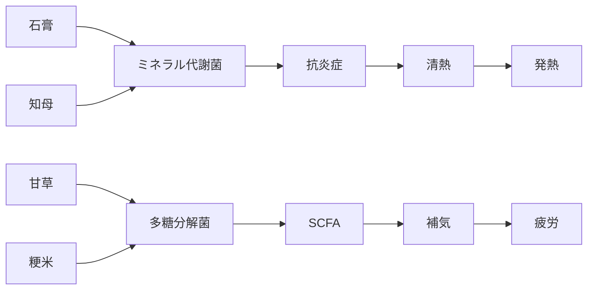

# 白虎湯（Byakkoto）ネットワーク図

```mermaid
graph LR
    Sekko[石膏]
    Chimo[知母]
    Kanzo[甘草]
    Kome[粳米]

    Mineral[ミネラル代謝菌]
    Poly[多糖分解菌]

    AntiInf[抗炎症]
    SCFA[SCFA]

    Seinetu[清熱]
    HoKi[補気]

    Fever[発熱]
    Fatigue[疲労]

    Sekko --> Mineral
    Chimo --> Mineral
    Kanzo --> Poly
    Kome --> Poly

    Mineral --> AntiInf
    Poly --> SCFA

    AntiInf --> Seinetu
    SCFA --> HoKi

    Seinetu --> Fever
    HoKi --> Fatigue
```