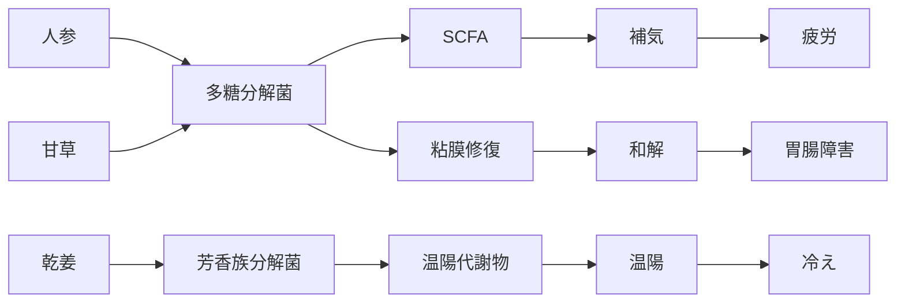

# 人参湯（Ninjin-to）ネットワーク図

```mermaid
graph LR
    Ninjin[人参]
    Kankyo[乾姜]
    Kanzo[甘草]

    Poly[多糖分解菌]
    Aro[芳香族分解菌]

    SCFA[SCFA]
    WarmM[温陽代謝物]
    Mucosa[粘膜修復]

    HoKi[補気]
    Onyo[温陽]
    Wakai[和解]

    Fatigue[疲労]
    Cold[冷え]
    GI[胃腸障害]

    Ninjin --> Poly
    Kankyo --> Aro
    Kanzo --> Poly

    Poly --> SCFA
    Poly --> Mucosa
    Aro --> WarmM

    SCFA --> HoKi
    Mucosa --> Wakai
    WarmM --> Onyo

    HoKi --> Fatigue
    Onyo --> Cold
    Wakai --> GI
```