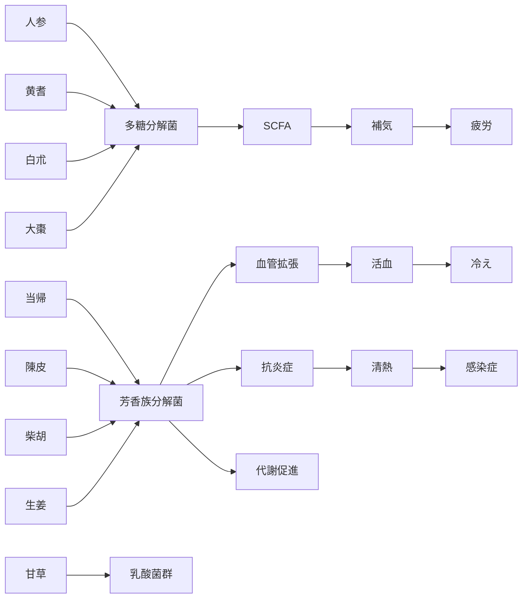

# 補中益気湯（Hochuekkito）ネットワーク図

```mermaid
graph LR
    Ninjin[人参]
    Ougi[黄耆]
    Byakujutsu[白朮]
    Touki[当帰]
    Chinpi[陳皮]
    Saiko[柴胡]
    Shoukyou[生姜]
    Taiso[大棗]
    Kanzo[甘草]

    Poly[多糖分解菌]
    Aro[芳香族分解菌]
    Lacto[乳酸菌群]

    SCFA[SCFA]
    Vaso[血管拡張]
    AntiInf[抗炎症]
    Metabo[代謝促進]

    HoKi[補気]
    Kakketsu[活血]
    Seinetu[清熱]

    Fatigue[疲労]
    Cold[冷え]
    Infection[感染症]

    Ninjin --> Poly
    Ougi --> Poly
    Byakujutsu --> Poly
    Touki --> Aro
    Chinpi --> Aro
    Saiko --> Aro
    Shoukyou --> Aro
    Taiso --> Poly
    Kanzo --> Lacto

    Poly --> SCFA
    Aro --> Vaso
    Aro --> AntiInf
    Aro --> Metabo

    SCFA --> HoKi
    Vaso --> Kakketsu
    AntiInf --> Seinetu

    HoKi --> Fatigue
    Kakketsu --> Cold
    Seinetu --> Infection
```