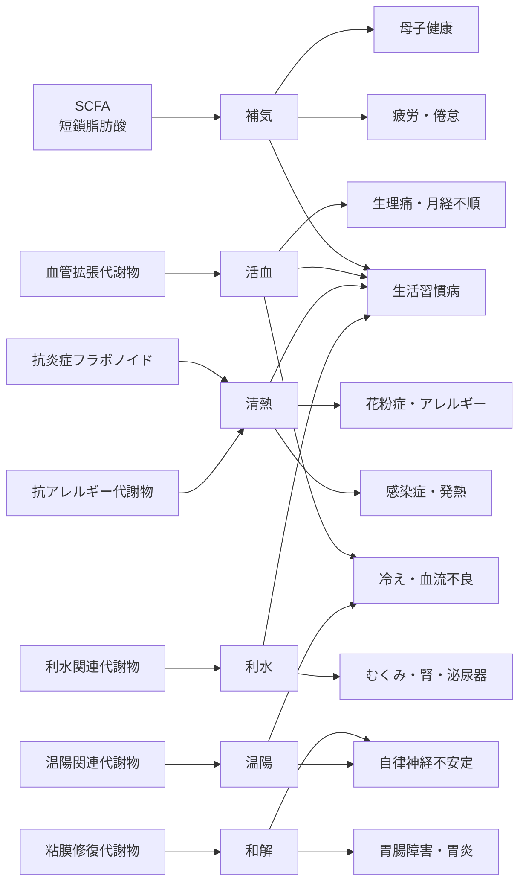

### 代謝物 × 証 × 症状の全体マップ（Mermaid）

```mermaid
graph LR
    %% 代謝物クラスター
    SCFA[SCFA<br/>短鎖脂肪酸]
    Vaso[血管拡張代謝物]
    AntiInflam[抗炎症フラボノイド]
    AntiAllergy[抗アレルギー代謝物]
    Mucosa[粘膜修復代謝物]
    DiureticM[利水関連代謝物]
    WarmM[温陽関連代謝物]

    %% 証
    HoKi[補気]
    Kakketsu[活血]
    Seinetu[清熱]
    Risui[利水]
    Onyo[温陽]
    Wakai[和解]

    %% 症状・社会的適応
    Fatigue[疲労・倦怠]
    Maternal[母子健康]
    MetS[生活習慣病]
    Coldness[冷え・血流不良]
    Dysmen[生理痛・月経不順]
    Infection[感染症・発熱]
    Allergy[花粉症・アレルギー]
    GI[胃腸障害・胃炎]
    Edema[むくみ・腎・泌尿器]
    Neuro[自律神経不安定]

    %% 代謝物 → 証
    SCFA --> HoKi
    Vaso --> Kakketsu
    AntiInflam --> Seinetu
    AntiAllergy --> Seinetu
    Mucosa --> Wakai
    DiureticM --> Risui
    WarmM --> Onyo

    %% 証 → 症状
    HoKi --> Fatigue
    HoKi --> Maternal
    HoKi --> MetS

    Kakketsu --> Coldness
    Kakketsu --> Dysmen
    Kakketsu --> MetS

    Seinetu --> Infection
    Seinetu --> Allergy
    Seinetu --> MetS

    Wakai --> GI
    Wakai --> Neuro

    Risui --> Edema
    Risui --> MetS

    Onyo --> Coldness
    Onyo --> Neuro

```