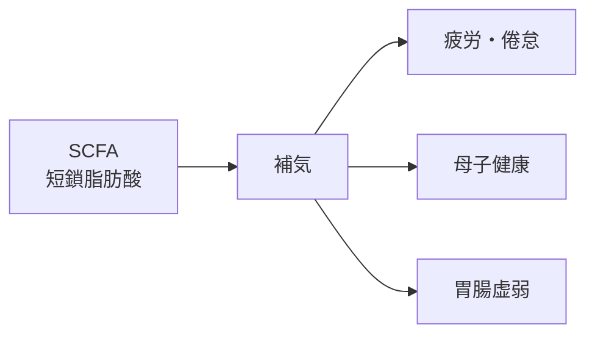

## 代謝物クラスター別の小さなサブグラフ（例：SCFA）

```mermaid
graph LR
    SCFA[SCFA<br/>短鎖脂肪酸]
    HoKi[補気]
    Fatigue[疲労・倦怠]
    Maternal[母子健康]
    GI[胃腸虚弱]

    SCFA --> HoKi
    HoKi --> Fatigue
    HoKi --> Maternal
    HoKi --> GI
```