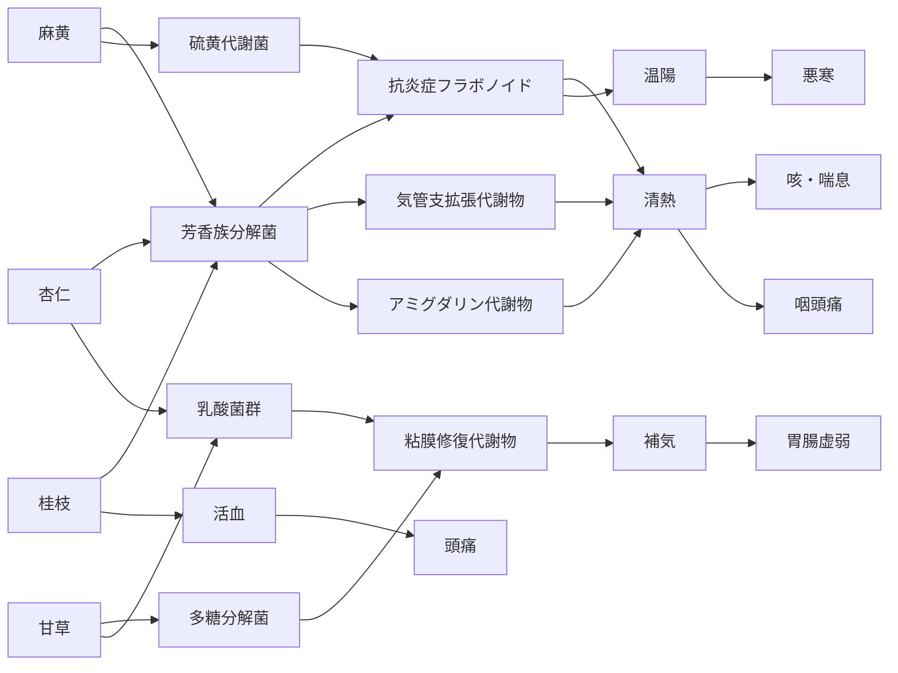

## 麻黄湯ネットワーク（生薬 → 代謝 → 証 → 症状）Mermaid版

```mermaid
graph LR
    %% 生薬
    Maou[麻黄]
    Keishi[桂枝]
    Annin[杏仁]
    Kanzo[甘草]

    %% MBT55経路（ざっくり）
    Aro[芳香族分解菌]
    Sul[硫黄代謝菌]
    Lacto[乳酸菌群]
    Poly[多糖分解菌]

    %% 代謝物
    Broncho[気管支拡張代謝物]
    AntiInf[抗炎症フラボノイド]
    MucosaM[粘膜修復代謝物]
    Amig[アミグダリン代謝物]

    %% 証
    SeinetuM[清熱]
    OnyoM[温陽]
    KakketsuM[活血]
    HoKiM[補気]

    %% 症状
    Cough[咳・喘息]
    Chill[悪寒]
    Headache[頭痛]
    Throat[咽頭痛]
    GIprob[胃腸虚弱]

    %% 生薬 → MBT55
    Maou --> Aro
    Maou --> Sul
    Keishi --> Aro
    Annin --> Aro
    Annin --> Lacto
    Kanzo --> Poly
    Kanzo --> Lacto

    %% MBT55 → 代謝物
    Aro --> AntiInf
    Aro --> Broncho
    Sul --> AntiInf
    Lacto --> MucosaM
    Poly --> MucosaM
    Aro --> Amig

    %% 代謝物 → 証
    Broncho --> SeinetuM
    AntiInf --> SeinetuM
    AntiInf --> OnyoM
    MucosaM --> HoKiM
    Amig --> SeinetuM

    %% 証 → 症状
    SeinetuM --> Cough
    SeinetuM --> Throat
    OnyoM --> Chill
    KakketsuM --> Headache
    HoKiM --> GIprob

    %% 桂枝 → 活血のブリッジ
    Keishi --> KakketsuM
```