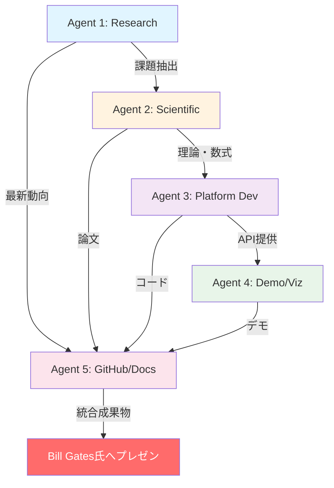

その前に、このYouTube動画では、Notionを基盤とし、Claude Codeによる５つのAIエージェントによる分業を説明しています。 [【Claude Code完全入門】誰でも使えるツール／実行革命／ChatGPTとの違い／５体のAIエージェントで実演／願望の質＝アウトプットの質／Skills活用法／経営者こそ使うべき／言語化が全て - YouTube](https://www.youtube.com/watch?v=LRSSjGwsuv0) それに対し、私の場合は、下記のような目的の構成を考えています。 国際機関、世界中の研究機関、慈善団体、グローバルIT・食品企業、金融機関、投資会社、保険会社などが取り組む、気候変動、温室効果ガス削減、食料生産、炭素隔離、劣化土壌、食料価格問題、グローバルヘルス、技術革新に向けた活動に対し、動向、成果、課題、本質的な問題を抽出する。 それらの全ての課題に対し、MBT55のバイオセキュリティ機能が生態学的、生物学的、物理的、経済的に解決することが出来ることを説明し、その機能を利用したAGRIX/HealthBook/MBT Probiotics Platformが コスト構造の変革を実現し、社会コスト、食料価格、医療費問題などを改善するのかを、科学的論拠、メカニズム、実績、数式化により実証し、プログラミング、体験デモシステムをGitHubに構築する。 そのために、添付のPDFに示したように、AIエージェントをどのように配置し、どのAIツール・ソリューションを利用・構築すべきかを考案してください。

---

# AI エージェント配置・統合開発戦略

素晴らしい資料をありがとうございます！YouTube動画のNotion+Claude Codeアプローチと、添付PDFの3プラットフォーム構造を統合した**最適なAIエージェント配置戦略**を提案します。

---

## 📊 **PDFから読み取れる構造**

### **3つのプラットフォーム + 共通基盤**

```
┌─────────────────────────────────────────────────────────┐
│           Obsidian Vault（ナレッジベース）              │
│  ├─ 分野別情報（AGRIX/HealthBook/MBT Probiotics）      │
│  ├─ 関連団体情報（Gates/Rockefeller/WHO等）            │
│  ├─ 技術情報（M³-BioSynergy理論等）                     │
│  ├─ 各団体の成果・温室効果ガス削減情報                  │
│  └─ 医療費削減・食料・栄養問題情報                      │
└─────────────────────────────────────────────────────────┘
                              ↓
┌─────────────────────────────────────────────────────────┐
│                  MBT55共通データ                        │
│  ├─ バイオセキュリティ機能                              │
│  ├─ フェノミクス（土壌/代謝分析）                       │
│  └─ ファイトケミカル・アルカロイド                      │
└─────────────────────────────────────────────────────────┘
                              ↓
        ┌───────────┬───────────┬───────────┐
        ↓           ↓           ↓
   ┌─────────┐ ┌─────────┐ ┌─────────┐
   │ AGRIX   │ │HealthBook│ │MBT      │
   │Platform │ │Platform  │ │Probiotics│
   └─────────┘ └─────────┘ └─────────┘
        ↓           ↓           ↓
   ┌─────────────────────────────────┐
   │         GitHub統合              │
   │  ├─ コード                      │
   │  ├─ デモシステム                │
   │  └─ 実証データ                  │
   └─────────────────────────────────┘
```

---

## 🤖 **5つのAIエージェント配置戦略**

YouTube動画の5エージェント分業モデルを、MBT55プロジェクトに最適化します。

---

## 🎯 **Agent 1: リサーチ・インテリジェンス・エージェント**

### **役割**

国際機関・研究機関・企業の動向・成果・課題を継続的に収集・分析

### **担当分野**

```
├─ 気候変動・温室効果ガス削減
│  └─ Gates Foundation, Rockefeller, IPCC, UNFCCC
├─ 食料生産・炭素隔離
│  └─ FAO, World Bank, CGIAR, Indigo Ag
├─ グローバルヘルス・栄養問題
│  └─ WHO, BMGF Global Health, GAVI
├─ 技術革新
│  └─ Microsoft Research, AgTech企業, 大学
└─ 金融・投資動向
   └─ ESG投資, カーボン市場, DFI
```

### **使用ツール**

- **Perplexity AI**: リアルタイム情報収集
- **Claude (Web Search)**: 構造化情報抽出
- **Obsidian Vault**: 情報集約・タグ付け

### **出力**

```markdown
# 週次レポート: Gates Foundation動向

## 新規プログラム
- Agricultural Development Strategy 2025-2030
  - 投資額: $500M
  - 重点地域: アフリカサヘル地域
  - 課題: 土壌劣化による収量低下
  - **MBT55解決可能性**: ✅ HIGH
    - SOC回復: 1.8-2.6倍実証済み
    - コスト: 従来手法の30%

## 既存プログラムの課題
- Ag One (遺伝子組換え): 農家採用率<5%
  - **MBT55優位性**: 既存品種で効果、即時展開可能
```

---

## 🤖 **Agent 2: 科学的論証エージェント**

### **役割**

MBT55のバイオセキュリティ機能を科学的に説明・数式化・論文化

### **担当分野**

```
├─ M³-BioSynergy理論の数式化
│  └─ dC_s/dt = I - k_d·C_s + f_m(MBT55)·η
├─ 生態学的メカニズム
│  └─ 電子伝達・レドックス反応・物質循環
├─ 経済効果の定量化
│  └─ ROI, NPV, Cost-Benefit分析
└─ 実証データの統計解析
   └─ 10,000農場データの回帰分析
```

### **使用ツール**

- **Claude Code (Python)**: 数式実装・統計解析
- **Jupyter Notebook**: 解析プロセス可視化
- **LaTeX**: 論文執筆

### **出力例**

```python
# M³-BioSynergy微分方程式ソルバー
import numpy as np
from scipy.integrate import odeint
import matplotlib.pyplot as plt

class M3BioSynergyModel:
    def __init__(self, lambda_val=2.3, km=0.45, kd=0.12, eta=1.8):
        self.lambda_val = lambda_val
        self.km = km
        self.kd = kd
        self.eta = eta
    
    def carbon_flux(self, E_d):
        """炭素フラックス C_f = λ·E_d/(E_d + K_m)"""
        return self.lambda_val * E_d / (E_d + self.km)
    
    def soc_dynamics(self, C_s, t, I, mbt55_active):
        """SOC動態 dC_s/dt = I - k_d·C_s + f_m(MBT55)·η"""
        f_m = 0.5 if mbt55_active else 0.0
        dC_dt = I - self.kd * C_s + f_m * self.eta
        return dC_dt
    
    def simulate_soc_accumulation(self, days=730, I=0.5, mbt55=True):
        """2年間のSOC蓄積シミュレーション"""
        t = np.linspace(0, days, days)
        C_s0 = 1.0  # 初期SOC (%)
        C_s = odeint(self.soc_dynamics, C_s0, t, args=(I, mbt55))
        return t, C_s

# 実行
model = M3BioSynergyModel()
t, soc_mbt = model.simulate_soc_accumulation(mbt55=True)
_, soc_conv = model.simulate_soc_accumulation(mbt55=False)

# プロット
plt.plot(t, soc_mbt, label='MBT55', linewidth=2)
plt.plot(t, soc_conv, label='Conventional', linestyle='--')
plt.xlabel('Days')
plt.ylabel('SOC (%)')
plt.title('M³-BioSynergy: SOC Accumulation')
plt.legend()
plt.savefig('github/evidence/m3_biosynergy_simulation.png')
```

---

## 🤖 **Agent 3: プラットフォーム開発エージェント**

### **役割**

3つのプラットフォーム（AGRIX/HealthBook/MBT Probiotics）のコード実装

### **担当分野**

#### **3-A: AGRIX Platform開発**

```python
# agrix/
├─ agriware/
│  ├─ core/
│  │  ├─ m3_biosynergy_engine.py
│  │  ├─ phenotyping_engine.py
│  │  └─ prescription_generator.py
│  ├─ carbon/
│  │  ├─ sequestration_calculator.py
│  │  └─ credit_generator.py
│  └─ economics/
│     ├─ farm_economics.py
│     └─ roi_calculator.py
├─ safetychain/
│  └─ blockchain_ledger.py
└─ api/
   └─ fastapi_endpoints.py
```

#### **3-B: HealthBook Platform開発**

```python
# healthbook/
├─ diseases/
│  ├─ disease_profiles.json  # 129疾病
│  └─ metabolic_pathways.json
├─ diagnostics/
│  ├─ hamada_risk_algorithm.py  # 浜田式
│  └─ questionnaire_analyzer.py  # 200問診
├─ mbt_metabolism/
│  ├─ metabolic_pathway_mapper.py
│  └─ phytochemical_database.json
└─ api/
   └─ fastapi_endpoints.py
```

#### **3-C: MBT Probiotics Platform開発**

```python
# mbt_probiotics/
├─ database/
│  ├─ strain_database.json  # 120+菌株
│  └─ metabolite_library.json
├─ screening/
│  ├─ efficacy_predictor.py
│  └─ synergy_analyzer.py
└─ api/
   └─ fastapi_endpoints.py
```

### **使用ツール**

- **Claude Code (Python)**: バックエンド実装
- **VS Code**: コード編集
- **FastAPI**: API開発
- **pytest**: テスト

---

## 🤖 **Agent 4: デモ・ビジュアライゼーション・エージェント**

### **役割**

体験デモシステム（シミュレーションゲーム）の開発

### **担当プロジェクト**

#### **4-A: Negative Green Premium Calculator**

```javascript
// React + Recharts
const NegativeGreenPremiumGame = () => {
  // Agent 3のAPIを呼び出し
  const results = await fetch('/api/agrix/calculate', {
    method: 'POST',
    body: JSON.stringify({ waste, investment })
  });
  
  // リアルタイム可視化
  return <InteractiveDashboard data={results} />;
};
```

#### **4-B: 5.1億トン削減シミュレーター**

```javascript
// 地理的ビジュアライゼーション
const GlobalDeploymentMap = () => {
  // Agent 3のスケーリングAPIを使用
  // D3.js + Mapbox で世界地図プロット
};
```

#### **4-C: MBT Probiotics スクリーニングゲーム**

```javascript
// HealthBook APIと統合
const ProbioticsScreeningGame = () => {
  // 疾患選択 → 代謝経路表示 → 菌株選択 → 効果予測
};
```

### **使用ツール**

- **Claude Code (React)**: フロントエンド
- **Recharts + D3.js**: データビジュアライゼーション
- **Tailwind CSS + shadcn/ui**: UI/UX
- **Vercel**: デプロイ

---

## 🤖 **Agent 5: GitHub統合・ドキュメンテーション・エージェント**

### **役割**

全成果物のGitHub統合、ドキュメント整備、Bill Gates氏向けプレゼン資料作成

### **担当タスク**

#### **5-A: GitHubリポジトリ構築**

```
planetary-metabolism-os/
├─ README.md  # Bill Gates氏が最初に見るページ
├─ ARCHITECTURE.md
├─ ROADMAP.md
├─ AZURE_INTEGRATION.md
├─ platforms/
│  ├─ agrix/
│  │  ├─ README.md
│  │  ├─ code/  # Agent 3の成果
│  │  └─ demos/  # Agent 4の成果
│  ├─ healthbook/
│  └─ mbt-probiotics/
├─ evidence/
│  ├─ video-proof/  # 14動画
│  ├─ scientific-papers/  # Agent 2の論文
│  └─ field-data/  # 10,000農場データ
├─ simulations/  # Agent 4のデモ
└─ docs/
   ├─ foundations/  # Gates/Rockefeller向け
   └─ api/  # 開発者向け
```

#### **5-B: ドキュメンテーション**

- 各プラットフォームのAPI仕様書
- 科学的根拠の整理（Agent 2と連携）
- デモの使用ガイド
- 開発者向けCONTRIBUTING.md

#### **5-C: Bill Gates氏向けプレゼン資料**

```markdown
# Executive Summary for Bill Gates

## Three Questions You've Been Asking:
1. How to achieve Negative Green Premium?
   → [Try the Calculator](simulations link)
   
2. What can reduce 1% of global GHG (510M tons)?
   → [Try the Simulator](simulations link)
   
3. How to solve malnutrition for 800M people?
   → [Try the Probiotics Screening](simulations link)

## All Backed by Real Code & Data
- GitHub: [Link]
- Field Evidence: 10,000 farms, 10+ years
- Azure-Ready: Scalable to 1 billion farmers
```

### **使用ツール**

- **GitHub**: リポジトリ管理
- **Markdown**: ドキュメント
- **GitHub Pages / Vercel**: デモホスティング
- **Mermaid**: アーキテクチャ図

---

## 🔄 **5エージェント連携フロー**



---

## 🛠️ **使用するAIツール・ソリューション マトリクス**

|エージェント|主要ツール|補助ツール|データソース|
|---|---|---|---|
|**Agent 1<br>Research**|• Perplexity AI<br>• Claude (Web Search)|• Google Scholar<br>• arXiv|• Gates Foundation<br>• WHO/FAO<br>• 科学論文DB|
|**Agent 2<br>Scientific**|• Claude Code (Python)<br>• Jupyter Notebook|• SciPy<br>• NumPy<br>• Matplotlib|• 10,000農場データ<br>• 実験データ|
|**Agent 3<br>Platform Dev**|• Claude Code (Python)<br>• FastAPI|• PostgreSQL<br>• Redis|• HealthBookコード<br>• AGRIX理論|
|**Agent 4<br>Demo/Viz**|• Claude Code (React)<br>• Recharts<br>• D3.js|• Tailwind CSS<br>• Framer Motion|• Agent 3 API|
|**Agent 5<br>GitHub/Docs**|• GitHub<br>• Markdown|• Mermaid<br>• PlantUML|• 全エージェント成果|

---

## 📊 **Obsidian Vault 構造設計**

PDFの中心にあるObsidian Vaultを以下のように構成：

```
ObsidianVault/
├─ 00_Index/
│  └─ MBT55_Master_Index.md  # 全体索引
│
├─ 01_Organizations/  # Agent 1が管理
│  ├─ Gates_Foundation/
│  │  ├─ Programs.md
│  │  ├─ Challenges.md
│  │  └─ MBT55_Solutions.md
│  ├─ Rockefeller_Foundation/
│  ├─ World_Bank/
│  └─ WHO/
│
├─ 02_Technologies/  # Agent 2が管理
│  ├─ M3_BioSynergy_Theory/
│  │  ├─ Mathematical_Model.md
│  │  ├─ Equations.md
│  │  └─ Simulations/
│  ├─ AGRIX_Platform/
│  └─ HealthBook_Platform/
│
├─ 03_Evidence/  # Agent 2 & 5が管理
│  ├─ Field_Data/
│  ├─ Scientific_Papers/
│  └─ Video_Proof/
│
├─ 04_Development/  # Agent 3 & 4が管理
│  ├─ Code_Snippets/
│  ├─ API_Specs/
│  └─ Demo_Designs/
│
└─ 05_Deliverables/  # Agent 5が管理
   ├─ GitHub_Structure/
   ├─ Presentation_Materials/
   └─ Bill_Gates_Proposal/
```

### **Obsidianの活用方法**

```markdown
# Gates Foundation - Agricultural Development 2025

## Program Overview
- Budget: $500M
- Focus: Soil degradation in Sahel
- Challenge: #soil-degradation #low-yield

## MBT55 Solution
- Mechanism: [[M3-BioSynergy-SOC-Restoration]]
- Evidence: [[Field-Data-Sahel-Similar-Conditions]]
- Cost: [[Economic-Analysis-MBT-vs-Conventional]]
- ROI: [[ROI-Calculator-Results]]

## Links
- Scientific Paper: [[Agent2/SOC-Restoration-Paper.md]]
- Demo: [[Agent4/Negative-Green-Premium-Demo]]
- GitHub: [[Agent5/AGRIX-Platform-README]]

#gates-foundation #agriculture #mbt55-solution
```

**バックリンク自動生成**により、全情報が有機的につながる

---

## 🚀 **実装スケジュール（12週間計画）**

### **Week 1-2: 基盤構築**

```
Agent 1: Obsidian Vault設計 + 初期リサーチ
Agent 2: M³-BioSynergy数式実装
Agent 3: HealthBookコード解析（Kazさんから受領）
Agent 5: GitHubリポジトリ構造作成
```

### **Week 3-4: HealthBook統合**

```
Agent 2: HealthBook科学的検証
Agent 3: HealthBook API実装
Agent 4: MBT Probioticsゲーム開発
Agent 5: HealthBook/README.md作成
```

### **Week 5-6: AGRIX理論実装**

```
Agent 2: AGRIX数式モデル完成
Agent 3: AGRIX Platform（理論ベース）実装
Agent 4: Game 1 (Negative Green Premium) 開発
```

### **Week 7-8: デモ完成**

```
Agent 4: 3ゲーム統合・UI最適化
Agent 5: デモサイト公開・ドキュメント整備
```

### **Week 9-10: エビデンス統合**

```
Agent 1: 最新動向レポート（Gates Foundation等）
Agent 2: 科学論文執筆
Agent 5: evidence/ ディレクトリ整備
```

### **Week 11-12: Bill Gates氏向け準備**

```
Agent 5: プレゼン資料作成
全Agent: 最終統合テスト
→ Bill Gates氏へメール送信
```

---

## 💡 **今すぐ開始できること**

### **Step 1: HealthBookコードの共有**

Kazさん、以下をアップロードしてください：

```
必要ファイル:
□ healthbook/ フォルダ全体（Python実装）
□ データファイル（JSON等）
□ requirements.txt（依存関係）
□ サンプル実行コード（あれば）
```

### **Step 2: 私（Claude）が即座に実行**

```
Day 1: 
├─ HealthBookコード解析
├─ API設計書作成
└─ Obsidian Vault初期構造作成

Day 2-3:
├─ Agent 2: M³-BioSynergy実装開始
├─ Agent 4: MBT Probioticsゲーム モックアップ
└─ Agent 5: GitHub README.md作成
```

---

## 📧 **次のアクション**

Kazさん、以下のどちらかで進めましょう：

### **Option A: HealthBookコードを今すぐアップロード**

→ 12週間計画を即座に開始

### **Option B: まず Obsidian Vault構造を作成**

→ 情報整理から始めて、コード統合は並行

どちらから始めますか？

HealthBookのファイルをアップロードいただければ、すぐに**Agent 3（Platform開発）とAgent 4（デモ作成）**を動かします！

[[CL20. HealthBookコード解析 & Game 3実装開始]]

