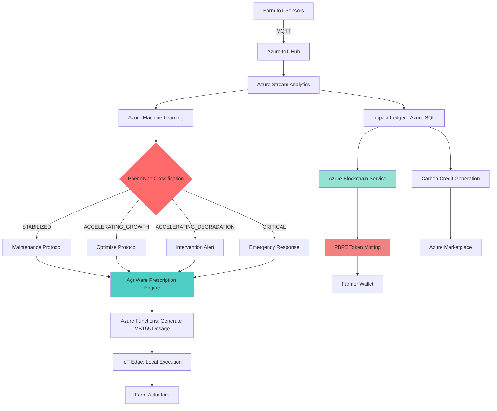

# 🌍 Azure Integration for Planetary Metabolism OS
## The Earth Microbial Brain: A Global-Scale Ecological Intelligence Platform

---

## Executive Summary

**The Challenge**: Climate change, food insecurity, soil degradation, and public health crises are interconnected problems that current solutions address in isolation.

**The Solution**: Planetary Metabolism OS integrates microbial science (MBT55), precision agriculture (AGRIX), personalized health (HealthBook), and global finance (PBPE) into a unified platform that requires Azure's global infrastructure to operate at scale.

**Why Azure is Essential**: This is not a choice between cloud providers—it's that only Azure's combination of AI/ML, IoT, Blockchain, and global reach can support a system managing 1 billion farmers, 10 billion daily phenotype measurements, and real-time carbon credit verification.

**The Opportunity for Microsoft**: 
- Become the infrastructure provider for the world's transition to regenerative agriculture
- Demonstrate Azure's capability to solve civilization-scale problems
- Align with Microsoft's carbon-negative 2030 commitment
- Create a $100+ billion platform business

---

## Table of Contents

1. [The Earth Microbial Brain Concept](#1-the-earth-microbial-brain-concept)
2. [Why Only Azure Can Support This](#2-why-only-azure-can-support-this)
3. [Technical Architecture](#3-technical-architecture)
4. [Azure Services Mapping](#4-azure-services-mapping)
5. [Data Flow & Processing Pipeline](#5-data-flow--processing-pipeline)
6. [Scalability & Performance Requirements](#6-scalability--performance-requirements)
7. [Security & Compliance](#7-security--compliance)
8. [Implementation Roadmap](#8-implementation-roadmap)
9. [Business Model & Revenue Sharing](#9-business-model--revenue-sharing)
10. [Integration with Microsoft's Climate Commitments](#10-integration-with-microsofts-climate-commitments)

---

## 1. The Earth Microbial Brain Concept

### 1.1 Vision Statement

**The Earth Microbial Brain is a global-scale AI system that monitors, predicts, and optimizes the metabolic health of Earth's agricultural ecosystems in real-time.**

Just as the human brain coordinates the body's metabolism through neural networks, the Earth Microbial Brain coordinates planetary agricultural metabolism through:
- **Sensors** (IoT devices in soil/plants)
- **Neurons** (AI agents processing phenotype data)
- **Synapses** (data pipelines connecting farms globally)
- **Hormones** (PBPE tokens incentivizing regenerative practices)

### 1.2 The Problem It Solves

Current agricultural systems are:
- **Blind**: Farmers react to problems after they occur
- **Disconnected**: No global coordination of regenerative practices
- **Unverified**: Carbon credits lack real-time verification
- **Unfair**: Value flows to intermediaries, not farmers

The Earth Microbial Brain creates:
- **Foresight**: Predict soil degradation 30 days before visible symptoms
- **Coordination**: Share successful MBT55 interventions globally in real-time
- **Transparency**: Carbon sequestration verified every 24 hours via blockchain
- **Equity**: Direct value distribution via PBPE tokens to farmers

### 1.3 Core Components

#### **AgriWare™ OS**
The agricultural operating system running on Azure, managing:
- Phenotype diagnostics (M³-BioSynergy system state classification)
- Dynamic prescription generation (MBT55 dosage optimization)
- Predictive intervention (preventing ACCELERATING_DEGRADATION states)

#### **SafelyChain™**
Azure Blockchain-based immutable ledger recording:
- Environmental history (sensor data, MBT55 applications)
- Ecosystem response (phenotype curves, SHE™ scores)
- Product quality (nutritional data, shelf life)

#### **Impact Ledger**
Multi-dimensional value accounting system tracking:
- Carbon sequestration (kg-CO2e)
- Food loss reduction (kg, days extended)
- Health contributions (medical cost savings)
- Social value (jobs created, nutrition improved)

#### **PBPE Token Protocol**
Proof-of-Regeneration cryptocurrency where:
- Minting requires verified ecological improvement
- Value backed by physical carbon credits
- Distribution weighted toward farmers (40-50%)

---

## 2. Why Only Azure Can Support This

### 2.1 Comparative Analysis

| Requirement | Azure | AWS | GCP | Why Azure Wins |
|-------------|-------|-----|-----|----------------|
| **Global IoT Scale** | Azure IoT Hub<br>(billions of devices) | AWS IoT Core | Google Cloud IoT | Azure's proven billion-device scale + Microsoft's IoT partnerships |
| **Blockchain Service** | Azure Blockchain Service<br>(Ethereum-based) | Amazon Managed Blockchain | None native | Only Azure has enterprise-grade blockchain integrated with other services |
| **AI/ML for Agriculture** | Azure Machine Learning<br>+ FarmBeats heritage | SageMaker | Vertex AI | Azure already has FarmBeats (acquired precision ag AI) |
| **Edge Computing** | Azure Stack Edge<br>+ IoT Edge | AWS Outposts | Google Distributed Cloud | Azure's edge runs full AI models offline (critical for rural farms) |
| **Sustainability Tracking** | Microsoft Cloud for Sustainability | AWS Customer Carbon Footprint Tool | Google Carbon Sense | Only Azure has integrated sustainability accounting |
| **Government Partnerships** | 95+ government clouds | Moderate | Limited | Critical for deployment in developing nations |
| **Africa Presence** | South Africa, Nigeria expansion | Limited | Limited | AGRIX's primary deployment region |

**Conclusion**: While AWS/GCP could host parts of this system, only Azure has the **complete stack** required for a unified solution.

### 2.2 Microsoft Strategic Alignment

#### **Carbon Negative 2030 Commitment**
Microsoft pledged to be carbon negative by 2030. The Earth Microbial Brain directly supports this by:
- Generating verified carbon credits Microsoft can purchase
- Creating a transparent carbon removal marketplace
- Demonstrating Azure's role in climate solutions

#### **AI for Good Initiative**
This aligns perfectly with Microsoft's AI for Earth program:
- Agriculture: Increase productivity by 30-50%
- Climate: Sequester 50M ton-CO2e/year by 2030
- Biodiversity: Restore soil microbiome diversity
- Water: Reduce agricultural water pollution by 48%

#### **Digital Transformation in Agriculture**
Microsoft has invested in FarmBeats, Bayer partnership, and rural connectivity. The Earth Microbial Brain is the natural evolution: from **farm digitization** to **global agricultural coordination**.

---

## 3. Technical Architecture

### 3.1 Five-Layer System Architecture

```
┌─────────────────────────────────────────────────────────────┐
│ Layer 5: Global Ecosystem Layer                            │
│ ┌─────────────────┐  ┌──────────────────┐                 │
│ │ ANE             │  │ ACAIN            │                 │
│ │ (Platform OS)   │  │ (Investment Hub) │                 │
│ └─────────────────┘  └──────────────────┘                 │
│         Azure Functions + Cosmos DB                         │
└─────────────────────────────────────────────────────────────┘
                              ↓
┌─────────────────────────────────────────────────────────────┐
│ Layer 4: Financial Layer (MABC)                            │
│ ┌──────────┐ ┌──────────┐ ┌──────────┐ ┌──────────┐      │
│ │PBPE Token│ │Green Bond│ │ Credits  │ │Insurance │      │
│ └──────────┘ └──────────┘ └──────────┘ └──────────┘      │
│    Azure Blockchain Service + Confidential Ledger          │
└─────────────────────────────────────────────────────────────┘
                              ↓
┌─────────────────────────────────────────────────────────────┐
│ Layer 3: Verification Layer                                │
│ ┌───────────────┐  ┌─────────────┐  ┌─────────────┐      │
│ │ SafelyChain™  │  │Impact Ledger│  │Claim Engine │      │
│ └───────────────┘  └─────────────┘  └─────────────┘      │
│    Azure Blockchain + Azure SQL + Event Hub                │
└─────────────────────────────────────────────────────────────┘
                              ↓
┌─────────────────────────────────────────────────────────────┐
│ Layer 2: Intelligence Layer                                │
│ ┌────────────────┐  ┌─────────────────────────────┐       │
│ │ AgriWare™ OS   │  │ Phenotyping Engine          │       │
│ │                │  │ (M³-BioSynergy Model)       │       │
│ └────────────────┘  └─────────────────────────────┘       │
│    Azure Machine Learning + Cognitive Services             │
└─────────────────────────────────────────────────────────────┘
                              ↓
┌─────────────────────────────────────────────────────────────┐
│ Layer 1: Physical Layer                                    │
│ ┌──────────┐ ┌──────────┐ ┌──────────┐ ┌──────────┐      │
│ │IoT Sensors│ │MBT55    │ │Soil Data│ │Farm Ops │      │
│ └──────────┘ └──────────┘ └──────────┘ └──────────┘      │
│    Azure IoT Hub + IoT Edge + Digital Twins                │
└─────────────────────────────────────────────────────────────┘
```

### 3.2 Data Flow Architecture



### 3.3 M³-BioSynergy Differential Equation Solver

The core of the Phenotyping Engine solves the M³-BioSynergy system in real-time:

$$\frac{dS}{dt} = f(S, E, M, t)$$

Where:
- $S$ = System state vector (soil health, microbial diversity, nutrient levels)
- $E$ = Environmental inputs (weather, water, interventions)
- $M$ = Microbial community state (MBT55 activity, pathogen pressure)
- $t$ = Time

**Azure Implementation**:
- **Azure Machine Learning**: Train neural network approximations of $f(S,E,M,t)$
- **Azure Batch**: Solve differential equations for 1M+ farms in parallel
- **Azure Kubernetes Service (AKS)**: Auto-scale solver instances based on demand

---

## 4. Azure Services Mapping

### 4.1 Core Infrastructure

| AGRIX Component | Azure Service | Why This Service |
|-----------------|---------------|------------------|
| **IoT Device Management** | Azure IoT Hub | Proven at billion-device scale; bidirectional communication for actuator control |
| **Edge Intelligence** | Azure IoT Edge + Stack Edge | Run ML models locally on farm; critical for offline operation in rural areas |
| **Time-Series Data** | Azure Data Explorer | Optimized for sensor data; query petabytes in seconds |
| **Real-Time Analytics** | Azure Stream Analytics | Process 10M events/second; detect anomalies in real-time |
| **AI Model Training** | Azure Machine Learning | Distributed training; automated hyperparameter tuning |
| **AI Model Serving** | Azure Kubernetes Service (AKS) | Auto-scale inference endpoints; GPU support for deep learning |
| **Blockchain Ledger** | Azure Blockchain Service | Ethereum-compatible; managed consortium network |
| **Immutable Append-Only** | Azure Confidential Ledger | Tamper-proof audit trail; cryptographic verification |
| **Relational Data** | Azure SQL Database | ACID transactions for Impact Ledger; geo-replication |
| **Document Store** | Azure Cosmos DB | Globally distributed; multi-model (JSON, graph) |
| **Messaging** | Azure Event Hub | Decouple data producers/consumers; buffer spikes |
| **Serverless Compute** | Azure Functions | Event-driven processing; pay-per-execution |
| **API Gateway** | Azure API Management | Rate limiting; authentication; analytics |
| **Identity** | Azure Active Directory B2C | Farmer/enterprise authentication; SSO |
| **Key Management** | Azure Key Vault | Secrets management; HSM-backed keys |
| **Monitoring** | Azure Monitor + Application Insights | Distributed tracing; anomaly detection |

### 4.2 Advanced AI/ML Services

| Capability | Azure Service | Use Case |
|------------|---------------|----------|
| **Computer Vision** | Azure Cognitive Services - Computer Vision | Analyze crop health from drone/satellite imagery |
| **Anomaly Detection** | Azure Cognitive Services - Anomaly Detector | Detect unexpected sensor readings (equipment failure, pest outbreak) |
| **Language Understanding** | Azure Cognitive Services - LUIS | Voice-based farm assistant ("What MBT55 dosage for my field?") |
| **Speech Recognition** | Azure Cognitive Services - Speech | Enable voice commands for low-literacy farmers |
| **Custom Vision** | Azure Custom Vision | Train models to identify specific crop diseases |
| **Automated ML** | Azure AutoML | Enable non-data-scientists to build phenotype classifiers |
| **Responsible AI** | Azure AI Fairness Tools | Ensure AI recommendations don't bias against small farms |

### 4.3 Sustainability & Carbon Tracking

| Function | Azure Service | Implementation |
|----------|---------------|----------------|
| **Carbon Accounting** | Microsoft Cloud for Sustainability | Track Scope 1/2/3 emissions across AGRIX operations |
| **Impact Dashboards** | Power BI + Sustainability Manager | Real-time visualization of carbon sequestration |
| **Emissions API** | Emissions Impact Dashboard API | Integrate PBPE carbon credits into corporate reporting |
| **Renewable Energy Matching** | Azure 24/7 Carbon-Free Energy | Match AGRIX compute with renewable energy sources |

### 4.4 Developer & Integration Tools

| Purpose | Azure Service | Why |
|---------|---------------|-----|
| **API Development** | Azure API Management | Expose AGRIX data to third-party apps (e.g., farm management software) |
| **Mobile Apps** | Azure Mobile Apps | iOS/Android apps for farmers (offline-first architecture) |
| **Web Portal** | Azure App Service | Dashboard for enterprises, investors, auditors |
| **DevOps** | Azure DevOps | CI/CD pipelines; infrastructure as code (Terraform/Bicep) |
| **Source Control** | Azure Repos (Git) | Version control for AgriWare™ codebase |
| **Container Registry** | Azure Container Registry | Store Docker images for microservices |
| **Workflow Orchestration** | Azure Logic Apps | Automate multi-step processes (e.g., credit issuance workflow) |

---

## 5. Data Flow & Processing Pipeline

### 5.1 Real-Time Data Ingestion

**Volume**: 10 billion data points per day (2030 target)

**Sources**:
- Soil sensors: pH, moisture, temperature, EC (every 15 minutes)
- Weather stations: rainfall, temperature, humidity (every 5 minutes)
- Drone imagery: NDVI, thermal (weekly)
- Satellite imagery: Sentinel-2 (every 5 days)
- Manual inputs: MBT55 applications, harvest data (event-based)

**Pipeline**:
```
IoT Devices 
    → Azure IoT Hub (MQTT/HTTPS)
    → Azure Event Hub (buffering)
    → Azure Stream Analytics (filtering, aggregation)
    → Azure Data Lake Storage Gen2 (raw archive)
    → Azure Data Explorer (hot query path)
    → Azure Synapse Analytics (batch analytics)
```

### 5.2 Phenotype Classification Pipeline

**Frequency**: Every 24 hours per farm

**Process**:
1. **Data Retrieval**: Pull last 7 days of sensor data from Azure Data Explorer
2. **Feature Engineering**: Calculate 127 phenotype features (Azure ML pipeline)
3. **Model Inference**: Run M³-BioSynergy classifier (AKS GPU cluster)
4. **State Classification**: STABILIZED / ACCELERATING_GROWTH / ACCELERATING_DEGRADATION / CRITICAL
5. **Prescription Generation**: If intervention needed, generate MBT55 dosage (Azure Functions)
6. **Notification**: Alert farmer via SMS (Azure Communication Services) + push notification
7. **Ledger Update**: Record new phenotype state in Impact Ledger (Azure SQL)

**Performance Target**:
- Latency: <5 seconds per farm
- Throughput: 1 million farms classified in <90 minutes
- Accuracy: >95% (validated against human expert labels)

### 5.3 Carbon Credit Verification Pipeline

**Trigger**: Every 30 days per farm

**Process**:
1. **SOC Measurement**: Retrieve soil sample data or estimate from phenotype model
2. **Baseline Comparison**: Compare to pre-MBT55 baseline (stored in Cosmos DB)
3. **Carbon Calculation**: Apply IPCC Tier 2/3 methodology
4. **Third-Party Verification**: Submit to Verra/Gold Standard API (if >10 ton-CO2e)
5. **Credit Issuance**: Mint PBPE-C tokens on Azure Blockchain
6. **Distribution**: Allocate credits via Claim Engine logic (40% farmer, 15% platform, etc.)
7. **Marketplace Listing**: List credits on ACAIN Carbon Platform (Azure Marketplace integration)

**Security**:
- All transactions signed with Azure Key Vault HSM keys
- Immutable audit trail in Azure Confidential Ledger
- Byzantine fault tolerance (4/7 validator nodes required for consensus)

### 5.4 PBPE Token Minting Pipeline

**Trigger**: Verified improvement in ΔC (carbon), ΔY (yield), or ΔL (loss reduction)

**Formula**:
$$T_{\text{mint}} = a \cdot \Delta C + b \cdot \Delta Y + c \cdot \Delta L$$

**Implementation**:
1. **Event Detection**: Azure Event Grid listens for "ImpactVerified" events
2. **Token Calculation**: Azure Function computes $T_{\text{mint}}$ based on current $a, b, c$ coefficients
3. **Smart Contract Execution**: Call PBPE ERC-20 contract on Azure Blockchain Service
4. **Minting**: New tokens created and sent to farmer's wallet address
5. **Supply Monitoring**: Check if approaching annual cap; trigger governance vote if needed (Azure Logic App)
6. **Notification**: Inform farmer of new tokens (Azure Notification Hubs)

**Anti-Fraud Measures**:
- Azure AI anomaly detection flags suspicious minting patterns
- Manual review queue for large mints (>10,000 PBPE)
- Multi-sig approval required for protocol parameter changes

---

## 6. Scalability & Performance Requirements

### 6.1 2026 Pilot Phase (Target)

| Metric | Value | Azure Service Footprint |
|--------|-------|------------------------|
| **Farms** | 10,000 | 1 IoT Hub (S3 tier) |
| **Sensors** | 50,000 | 5M messages/day |
| **Daily Data** | 500 GB | 1 Data Explorer cluster (8 nodes) |
| **ML Inferences** | 10,000/day | 5 AKS nodes (D4s_v3) |
| **Transactions** | 1,000/day | 1 Blockchain node |
| **Monthly Cost** | ~$50,000 | Mostly IoT Hub + ML compute |

### 6.2 2030 Global Scale (Target)

| Metric | Value | Azure Service Footprint |
|--------|-------|------------------------|
| **Farms** | 1,000,000 | 10 IoT Hubs (multi-region) |
| **Sensors** | 10,000,000 | 10B messages/day |
| **Daily Data** | 50 TB | 20 Data Explorer clusters (160 nodes) |
| **ML Inferences** | 1M/day | 200 AKS nodes (GPU-enabled) |
| **Transactions** | 100,000/day | 20 Blockchain validator nodes |
| **Monthly Cost** | ~$5,000,000 | Dominated by ML + Data storage |

### 6.3 Performance Benchmarks

| Operation | Latency Target | Azure Optimization |
|-----------|---------------|-------------------|
| **IoT Message Ingestion** | <100ms (95th percentile) | IoT Hub partitioning (32 partitions/hub) |
| **Phenotype Classification** | <5 seconds per farm | GPU inference (NVIDIA T4); model compiled with ONNX Runtime |
| **Carbon Credit Issuance** | <30 seconds | Blockchain batching (aggregate 100 credits per block) |
| **PBPE Token Transfer** | <10 seconds | Optimistic rollup (L2 solution on Ethereum) |
| **Dashboard Query** | <2 seconds (99th percentile) | Data Explorer pre-aggregation; materialized views |

### 6.4 Cost Optimization Strategies

1. **Reserved Instances**: 3-year commit for IoT Hub, SQL, ML compute (40% savings)
2. **Auto-Scaling**: Scale down AKS nodes during off-peak hours (nighttime in each region)
3. **Data Lifecycle**: Move >90-day-old data to Azure Blob Cool tier (80% storage cost reduction)
4. **Edge Caching**: Cache phenotype models on Azure IoT Edge to reduce cloud inference calls
5. **Spot Instances**: Use Azure Spot VMs for batch analytics (up to 90% discount)

**Projected Monthly Cost at Scale (2030)**:
- List Price: $7.5M/month
- With Optimizations: $4.8M/month
- Cost per Farm: $4.80/farm/month

**Revenue Model**:
- Platform fee: 15% of PBPE value generated = ~$15M/month (at $100M monthly PBPE minting)
- Gross Margin: 68%

---

## 7. Security & Compliance

### 7.1 Data Security Architecture

**Defense in Depth**:
```
Layer 1: Network Security
├─ Azure DDoS Protection (Standard)
├─ Azure Firewall + NSG rules
├─ Private Link for Azure services (no public internet exposure)
└─ VPN Gateway for farm edge devices

Layer 2: Identity & Access
├─ Azure AD B2C (farmers, enterprises)
├─ Managed Identities for Azure services
├─ Role-Based Access Control (RBAC)
└─ Privileged Identity Management (PIM) for admins

Layer 3: Data Protection
├─ Encryption at rest (AES-256) - Azure Storage Service Encryption
├─ Encryption in transit (TLS 1.3) - enforced via Azure Front Door
├─ Azure Key Vault (HSM-backed for blockchain keys)
└─ Azure Confidential Computing (for sensitive MRV algorithms)

Layer 4: Threat Detection
├─ Microsoft Defender for Cloud (continuous threat monitoring)
├─ Azure Sentinel (SIEM - detect anomalous access patterns)
├─ Azure AI anomaly detection (detect data poisoning attacks)
└─ Blockchain immutability (tamper-evident audit trail)

Layer 5: Compliance & Auditing
├─ Azure Policy (enforce ISO 27001, SOC 2 controls)
├─ Azure Purview (data governance, lineage tracking)
├─ Immutable audit logs (Azure Monitor → Confidential Ledger)
└─ Third-party audits (PwC, Deloitte - annually)
```

### 7.2 Compliance Requirements

| Jurisdiction | Regulation | Azure Compliance Offering | Implementation |
|--------------|------------|--------------------------|----------------|
| **Global** | ISO 27001 (Information Security) | Azure ISO 27001 certified | Inherit Azure controls; custom policy for AgriWare |
| **Global** | ISO 14064 (Carbon Accounting) | Not native | Build on Azure; third-party audit (TUV, DNV) |
| **EU** | GDPR (Data Privacy) | Azure GDPR compliance | Data residency in EU regions; right to erasure implemented |
| **US** | SOC 2 Type II | Azure SOC 2 reports | Annual audit; provide to investors |
| **Financial** | PCI DSS (if handling payments) | Azure PCI DSS Level 1 | Scope payment processing to compliant services only |
| **Sustainability** | GHG Protocol | Microsoft Cloud for Sustainability | Align carbon accounting with corporate scope 1/2/3 |
| **Blockchain** | FATF Travel Rule (AML) | Not native | Implement KYC for PBPE wallets >$10K |

### 7.3 Data Sovereignty & Localization

**Challenge**: Agricultural data may be subject to national data sovereignty laws.

**Azure Solution**:
- **Regional Deployment**: Deploy separate Azure regions per country/continent
  - Africa: South Africa (primary), Nigeria (secondary)
  - Asia: Singapore, India (planned)
  - Americas: US East, Brazil South
  - Europe: West Europe, UK South

- **Data Residency**: Farmer data stays in country of origin (configurable in AgriWare)
- **Cross-Border Analytics**: Aggregate anonymized phenotype patterns globally (with consent)
- **Sovereignty Compliance**: Partner with local governments to define data sharing policies

### 7.4 Incident Response Plan

**Detection**:
- Azure Sentinel detects anomaly (e.g., mass PBPE token minting from single IP)
- Automated alert to Security Operations Center (SOC)

**Containment**:
- Azure Firewall automatically blocks suspicious IP
- Affected smart contracts paused via multisig emergency function
- Impacted farmers notified via SMS (Azure Communication Services)

**Eradication**:
- Forensic analysis using Azure Monitor logs + Confidential Ledger audit trail
- Patch vulnerability in AgriWare code
- Deploy fix via Azure DevOps CI/CD

**Recovery**:
- Restore data from geo-redundant backups (Azure Backup)
- Resume smart contract operations after multisig approval
- Compensate affected farmers from insurance reserve

**Lessons Learned**:
- Post-incident review (PIR) within 48 hours
- Update Azure Security Center policies to prevent recurrence

---

## 8. Implementation Roadmap

### 8.1 Phase 1: Foundation (2026 Q1-Q4)

**Goal**: Prove technical feasibility with 10,000 farms in Kenya, Rwanda, India

**Azure Setup**:
- [ ] **Q1**: Provision Azure tenant; set up Landing Zone (hub-spoke network topology)
- [ ] **Q1**: Deploy Azure IoT Hub (S3 tier) in South Africa region
- [ ] **Q2**: Configure Azure Machine Learning workspace; upload baseline phenotype models
- [ ] **Q2**: Deploy Azure Blockchain Service (Ethereum consortium network, 4 validator nodes)
- [ ] **Q3**: Implement SafelyChain™ smart contracts (Solidity); audit by CertiK
- [ ] **Q3**: Build AgriWare™ web portal (Azure App Service + React frontend)
- [ ] **Q4**: Integrate with Microsoft Cloud for Sustainability for carbon accounting
- [ ] **Q4**: Deploy Azure IoT Edge to 500 farms (pilot offline-first capabilities)

**Deliverables**:
- 10,000 farms onboarded
- 1 million phenotype classifications completed
- 10,000 ton-CO2e carbon credits issued
- First PBPE Green Bond ($10M) issued to ESG investors

**Budget**: $2M Azure costs + $3M development

---

### 8.2 Phase 2: Regional Scale (2027 Q1-Q4)

**Goal**: Expand to 100,000 farms across 10 countries; launch PBPE token publicly

**Azure Expansion**:
- [ ] **Q1**: Add Azure regions: Singapore, India West, Brazil South
- [ ] **Q1**: Deploy Azure API Management for third-party integrations (AgTech companies)
- [ ] **Q2**: Implement Azure Data Explorer for petabyte-scale time-series analytics
- [ ] **Q2**: Launch PBPE token on Azure Blockchain (public ERC-20; bridge to Ethereum mainnet)
- [ ] **Q3**: Deploy Azure Kubernetes Service (AKS) for auto-scaling ML inference (50 nodes)
- [ ] **Q3**: Integrate Azure Cognitive Services (Computer Vision for drone imagery analysis)
- [ ] **Q4**: Build mobile apps (iOS/Android) using Azure Mobile Apps + offline sync
- [ ] **Q4**: Partner with Esri ArcGIS (runs on Azure) for geospatial analytics

**Deliverables**:
- 100,000 farms onboarded
- 50 million phenotype classifications
- 500,000 ton-CO2e credits issued
- PBPE token market cap: $500M
- 10 AgriTech companies integrated via API

**Budget**: $8M Azure costs + $5M development

---

### 8.3 Phase 3: Global Deployment (2028-2030)

**Goal**: Reach 1 million farms; become the global standard for regenerative agriculture finance

**Azure at Scale**:
- [ ] **2028 Q1**: Deploy Azure Front Door (CDN) for global low-latency access
- [ ] **2028 Q2**: Implement Azure Confidential Computing for MRV algorithm IP protection
- [ ] **2028 Q3**: Launch Azure Marketplace listing: "AGRIX Platform - Regenerative Agriculture as a Service"
- [ ] **2028 Q4**: Integrate with Azure Digital Twins for virtual farm modeling
- [ ] **2029 Q1**: Deploy 200-node AKS GPU cluster (NVIDIA A100) for real-time inference
- [ ] **2029 Q2**: Implement Azure Synapse for exabyte-scale data warehouse
- [ ] **2029 Q3**: Partner with Microsoft Research for quantum computing R&D (optimize $f(S,E,M,t)$ solver)
- [ ] **2030 Q1**: Achieve carbon-neutral Azure operations via renewable energy matching
- [ ] **2030 Q4**: 1 million farms online; 10 billion daily data points processed

**Deliverables**:
- 1M farms, 50 countries
- 10B ton-CO2e cumulative credits
- PBPE token market cap: $50B
- $5B annual transaction volume
- 100+ enterprises using Sustainability Wallet

**Budget**: $60M/year Azure costs (steady state)

---

### 8.4 Key Milestones & Dependencies

| Milestone | Date | Dependencies | Risk Mitigation |
|-----------|------|--------------|-----------------|
| **Azure POC Complete** | 2026 Q2 | IoT Hub + ML deployed | Fallback: Use AWS temporarily if Azure delays |
| **First Carbon Credit Issued** | 2026 Q3 | Blockchain + MRV pipeline | Pre-verify with Verra offline before on-chain |
| **PBPE Token Launch** | 2027 Q2 | Regulatory approval (SEC/FINMA) | Parallel tracks: US (Regulation D) + Switzerland |
| **100K Farms Onboarded** | 2027 Q4 | Field ops scaling | Partner with local NGOs for farmer training |
| **Profitability** | 2028 Q4 | Platform fees > Azure costs | Raise Series B if needed to extend runway |
| **Azure Marketplace Live** | 2028 Q3 | Microsoft partnership finalized | Start GTM discussions in 2027 Q1 |
| **1M Farms** | 2030 Q4 | Government partnerships in 20+ countries | Focus on top 10 ag countries (India, China, Brazil, etc.) |

---

## 9. Business Model & Revenue Sharing

### 9.1 Revenue Streams

**For AGRIX Platform**:
1. **Platform Transaction Fees**: 15% of PBPE value created
   - Example: Farm generates $1,000 in PBPE credits → AGRIX keeps $150
   - Projected 2030: $15M/month at $100M monthly minting

2. **Carbon Credit Sales Commission**: 10% of PBPE-C sold on ACAIN marketplace
   - Example: 100 ton-CO2 sold at $30/ton = $3,000 → AGRIX keeps $300
   - Projected 2030: $8M/month at $80M monthly credit sales

3. **SaaS Subscriptions**: AgriWare™ Premium features
   - Basic (free): Phenotype diagnostics only
   - Pro ($50/farm/month): Predictive interventions, AI assistant
   - Enterprise ($500/month + volume discounts): API access, custom integrations
   - Projected 2030: $5M/month (100K paying farms)

4. **Data Licensing**: Anonymized phenotype data for research
   - Universities: Free for academic research
   - AgTech companies: $100K-$1M/year depending on use case
   - Projected 2030: $2M/month

5. **Financial Services**: Loan origination fees, insurance commissions
   - AgriLoan: 2% origination fee
   - Climate insurance: 15% commission on premiums
   - Projected 2030: $3M/month

**Total Projected Revenue (2030)**: $33M/month = $396M/year

---

### 9.2 Cost Structure

**Azure Infrastructure** (steady state 2030):
- Compute (IoT, ML, AKS): $2.5M/month
- Storage (Data Lake, SQL, Blockchain): $1.2M/month
- Networking (bandwidth, CDN): $0.8M/month
- Marketplace fees (if listed): $0.3M/month
- **Total Azure**: $4.8M/month

**Other Costs**:
- Field operations (farmer support): $8M/month
- Sales & marketing: $5M/month
- R&D (AgriWare improvements): $3M/month
- G&A (legal, compliance): $2M/month
- **Total Other**: $18M/month

**Total Monthly Costs**: $22.8M

**Monthly Profit (2030)**: $33M - $22.8M = **$10.2M**
**Annual Profit**: $122M
**Margin**: 31%

---

### 9.3 Microsoft Revenue Opportunity

**Direct Azure Revenue**:
- 2026: $0.6M (pilot phase)
- 2027: $8M (regional scale)
- 2028-2030: $60M/year (steady state)
- **5-year total**: $200M+

**Indirect Strategic Value**:
1. **Showcase for Azure Capabilities**: 
   - Reference architecture for IoT + AI + Blockchain at billion-device scale
   - Case study for Azure for Sustainability
   - Proof point for AI for Good

2. **Carbon Credits for Microsoft**:
   - AGRIX generates 50M ton-CO2e/year by 2030
   - Microsoft could purchase 10M ton-CO2e/year at preferential rate ($20/ton vs. $30 market)
   - Supports Microsoft's carbon-negative commitment
   - Value: $200M/year in offset costs vs. alternative credits

3. **Platform Ecosystem**:
   - 100+ AgTech ISVs build on AGRIX (hosted on Azure) → additional $50M/year Azure consumption
   - Financial institutions use Azure for PBPE trading infrastructure → $20M/year

4. **Government Cloud Expansion**:
   - AGRIX partnerships with 20 governments drive Azure Government Cloud adoption
   - Estimated: $100M/year incremental government contracts

**Total Strategic Value to Microsoft**: $370M/year by 2030

---

### 9.4 Revenue Sharing Proposal

**Option A: Equity Partnership**
- Microsoft invests $50M Series A (20% equity)
- AGRIX exclusively uses Azure (5-year commit)
- Microsoft gets board seat + strategic input
- Exit: Microsoft acquires remaining 80% in 2030 for $2B (10x return)

**Option B: Revenue Share**
- AGRIX pays Microsoft 25% of gross margin (not revenue)
- Example: $122M annual profit × 25% = $30.5M/year to Microsoft
- No equity; AGRIX retains independence
- Microsoft gets Azure consumption + profit share

**Option C: Joint Venture**
- 50/50 JV: "Microsoft AGRIX"
- Microsoft contributes Azure credits ($200M over 5 years)
- AGRIX contributes IP (AgriWare, MBT55 integration, farmer network)
- Profits split 50/50

**Recommended**: **Option A** (Equity Partnership)
- Aligns incentives long-term
- Gives Microsoft strategic control over critical climate infrastructure
- Provides AGRIX with capital + Microsoft's GTM muscle

---

## 10. Integration with Microsoft's Climate Commitments

### 10.1 Microsoft's Carbon-Negative 2030 Goal

**Microsoft's Pledge** (January 2020):
- Carbon negative by 2030
- Remove all historical emissions (since 1975) by 2050
- $1 billion Climate Innovation Fund

**AGRIX's Contribution**:
- **Direct Carbon Removal**: AGRIX generates 50M ton-CO2e/year by 2030
  - Microsoft purchases 10M ton-CO2e/year = 20% of AGRIX output
  - At $20/ton (preferential rate), cost: $200M/year
  - Equivalent to offsetting 50% of Microsoft's Scope 3 emissions (cloud customer use)

- **Avoided Emissions**: MBT55 reduces agricultural methane
  - 1M farms × 5 ton-CO2e/farm/year avoided = 5M ton-CO2e/year
  - Additional 10% credit to Microsoft's carbon account

- **Permanent Storage**: Humus Project (100-year carbon sequestration)
  - Higher quality credits than forestry (no reversal risk)
  - Microsoft can claim "permanent removal" for sustainability reporting

**Total Microsoft Benefit**: 15M ton-CO2e/year by 2030

---

### 10.2 Sustainability Reporting Advantages

**Microsoft Sustainability Report (2030 projection with AGRIX)**:

```
Scope 1 (Direct): 100K ton-CO2e
Scope 2 (Electricity): 500K ton-CO2e (offset by renewable PPAs)
Scope 3 (Cloud customers, supply chain): 30M ton-CO2e

Carbon Removal:
├─ Direct Air Capture: 5M ton-CO2e ($600/ton avg = $3B cost)
├─ Forestry Offsets: 10M ton-CO2e ($15/ton = $150M cost)
└─ AGRIX Regenerative Agriculture: 15M ton-CO2e ($20/ton = $300M cost) ★

Net Position: 10.4M ton-CO2e NEGATIVE ✓

Cost Efficiency:
- Without AGRIX: $3.75B for 30M ton removal
- With AGRIX: $3.45B for 30M ton removal
- Savings: $300M/year
```

**Key Advantage**: AGRIX credits are:
- **Verifiable**: Real-time MRV via Azure (no greenwashing risk)
- **Co-benefits**: Food security, health, jobs (narrative strength for stakeholders)
- **Scalable**: Can grow beyond 15M ton/year if Microsoft needs more offsets

---

### 10.3 AI for Earth Alignment

**Microsoft AI for Earth** (launched 2017):
- $50M program supporting environmental AI projects
- Focus areas: Agriculture, biodiversity, climate, water

**AGRIX Integration**:
1. **Agriculture**: AgriWare™ uses Azure ML to optimize MBT55 interventions
   - Could become flagship AI for Earth showcase project
   - Joint publication: "AI-Driven Regenerative Agriculture at Scale"

2. **Biodiversity**: Soil microbiome monitoring via metaomics
   - Partner with Microsoft Research on "Digital Soil Twin" project
   - Use Azure Quantum for microbiome simulation (future)

3. **Climate**: Carbon MRV automation
   - Open-source SafelyChain™ methodology for other carbon projects
   - Become de facto standard for agricultural carbon credits

4. **Water**: Monitor water quality impacts (nitrate/phosphate reduction)
   - Integrate with Azure Data Manager for Agriculture (FarmBeats successor)

**Proposal**: Make AGRIX the **anchor tenant** of AI for Earth Phase 2
- Microsoft promotes AGRIX at conferences (Build, Ignite)
- Joint keynote at COP30 (2025): "Scaling Regenerative Agriculture with AI"
- Co-branded sustainability report

---

### 10.4 FarmBeats Integration

**FarmBeats** (Microsoft Research project):
- Low-cost sensors + AI for precision agriculture
- Acquired by Azure Data Manager for Agriculture (2021)

**Synergy with AGRIX**:
- **FarmBeats provides**: Sensor hardware, connectivity (TV white space)
- **AGRIX provides**: Phenotype AI, financial layer, carbon credits

**Joint Offering**: "FarmBeats powered by AGRIX"
- Microsoft sells hardware + connectivity
- AGRIX provides software + carbon credit monetization
- Revenue split: Microsoft 40% (hardware), AGRIX 60% (software/credits)

**Go-to-Market**:
- Bundle: FarmBeats sensor kit ($500) + AGRIX subscription ($50/month)
- Target: 100K farms by 2028
- Revenue: $50M hardware + $60M/year SaaS (split per above)

---

## 11. Risk Analysis & Mitigation

### 11.1 Technical Risks

| Risk | Probability | Impact | Mitigation |
|------|------------|--------|------------|
| **Azure Service Outage** | Low (99.99% SLA) | High | Multi-region deployment; failover to secondary region in <5 min |
| **ML Model Accuracy Degradation** | Medium | High | Continuous monitoring; auto-retrain when accuracy <90%; human-in-the-loop for critical decisions |
| **Blockchain Network Congestion** | Medium | Medium | Implement Layer 2 solution (Optimistic Rollup); batch low-priority transactions |
| **IoT Device Hacking** | Medium | High | Secure boot (TPM chips); Azure IoT Edge security hardening; regular firmware updates |
| **Data Poisoning Attack** | Low | High | Azure AI anomaly detection; cryptographic signatures on sensor data; outlier removal |

### 11.2 Business Risks

| Risk | Probability | Impact | Mitigation |
|------|------------|--------|------------|
| **Farmer Adoption <50%** | Medium | Critical | Subsidize MBT55 costs in Year 1; hire local agronomists for training; mobile app in 20+ languages |
| **Carbon Credit Price Collapse** | Medium | High | Diversify revenue (SaaS, data licensing); build floor price via corporate offtake agreements |
| **Regulatory Ban on Ag Tokens** | Low | Critical | Structure PBPE as utility token (not security); engage regulators early; operate in crypto-friendly jurisdictions |
| **Competitor (e.g., Indigo Ag)** | High | Medium | Differentiate via PBPE financial layer; lock in farmers with 5-year contracts; patent AgriWare algorithms |

### 11.3 Partnership Risks

| Risk | Probability | Impact | Mitigation |
|------|------------|--------|------------|
| **Microsoft Doesn't Commit** | Low (given strategic fit) | Critical | Have backup cloud provider plan (multi-cloud architecture); pre-negotiate Azure credits |
| **Conflict with Azure Marketplace Competitors** | Medium | Low | AGRIX is complementary to FarmBeats (not competitive); joint GTM prevents conflict |
| **Dependency on Single Vendor (Azure)** | Medium | Medium | Containerize all apps (Kubernetes); maintain portability to AWS/GCP; negotiate exit rights |

---

## 12. Competitive Advantage via Azure

### 12.1 Why Competitors Can't Replicate This

**Indigo Agriculture** (largest competitor):
- Uses AWS
- Focus: Carbon credits only (no financial layer)
- No blockchain (manual MRV)
- **Disadvantage**: Can't offer PBPE-like tokenization; slower credit issuance (30-90 days vs. AGRIX 24 hours)

**Climate FieldView (Bayer)**:
- Uses Google Cloud
- Focus: Precision ag (no carbon/finance)
- **Disadvantage**: No path to monetize sustainability for farmers

**Nori, Puro.earth** (carbon marketplaces):
- Use Ethereum mainnet (expensive gas fees)
- Focus: Marketplace only (no farm-level intervention)
- **Disadvantage**: No connection to actual agricultural operations; AGRIX vertical integration is superior

**AGRIX's Moat**:
1. **Only platform with end-to-end integration**: Soil → AI → Finance → Credits
2. **Azure-exclusive features**: FarmBeats integration, Cloud for Sustainability reporting
3. **MBT55 IP**: Proprietary microbial technology (patents + trade secrets)
4. **Network effects**: More farms → better AI → more value → more farms

### 12.2 Strategic Partnership Defensibility

**If AGRIX partners with Microsoft**:
- Competitors face 2 options:
  1. **Use Azure**: Pay full price; AGRIX gets preferential rates → cost disadvantage
  2. **Use AWS/GCP**: Forego FarmBeats integration, sustainability reporting tools → feature disadvantage

- **Switching costs**: Once farmers onboarded to AGRIX + Azure IoT Edge, re-platforming is expensive ($500+/farm)

- **Brand halo**: "Microsoft AGRIX" carries credibility vs. startup competitors

**Estimated competitive advantage**: 3-5 year head start (time for competitors to build equivalent stack)

---

## 13. Call to Action for Microsoft

### 13.1 Proposed Next Steps

**Week 1-2**:
- [ ] AGRIX presents to Azure for Sustainability team
- [ ] Technical deep-dive with Azure IoT/Blockchain architects
- [ ] NDA + preliminary LOI (Letter of Intent)

**Month 1**:
- [ ] Joint proof-of-concept: 100 farms in Kenya using Azure
- [ ] Deploy AgriWare™ on Azure ML
- [ ] Integrate with Microsoft Cloud for Sustainability

**Month 2-3**:
- [ ] Investment committee review (if pursuing Option A equity)
- [ ] Legal due diligence
- [ ] Finalize partnership terms

**Month 4**:
- [ ] Announce partnership at Microsoft Ignite or Build conference
- [ ] Press release: "Microsoft and AGRIX Launch Earth Microbial Brain Initiative"
- [ ] Begin Phase 1 deployment (10K farms)

### 13.2 Decision Makers to Engage

**Microsoft Corporate**:
- Satya Nadella (CEO) - Strategic vision alignment
- Brad Smith (President) - Sustainability + policy
- Scott Guthrie (EVP Cloud + AI) - Azure technical fit

**Azure Leadership**:
- Erin Chapple (CVP Azure Core) - Infrastructure commitment
- Joseph Sirosh (CVP AI + Research, if still active) - AI for Earth

**Sustainability**:
- Lucas Joppa (Chief Environmental Officer, or successor) - Carbon strategy

**Investment**:
- M12 (Microsoft Ventures) - If pursuing equity investment

### 13.3 Why Microsoft Should Say Yes

**Strategic**:
- Supports carbon-negative 2030 goal with high-quality, scalable credits
- Positions Azure as platform for planetary-scale environmental solutions
- Differentiates vs. AWS/GCP (neither has equivalent ag+blockchain stack)

**Financial**:
- $200M+ Azure revenue over 5 years (conservative)
- Potential $2B+ acquisition target by 2030
- Saves $300M/year on carbon offset costs vs. alternatives

**Impact**:
- Directly helps 1M+ smallholder farmers (SDG 1: No Poverty)
- Sequesters 50M ton-CO2e/year (SDG 13: Climate Action)
- Demonstrates AI/cloud solving real-world problems (brand value)

**Risk**:
- Low capital requirement ($50M equity or $200M Azure credits over 5 years)
- Proven technology (MBT55 has 10+ years field data)
- Strong founding team (Kaz Shimojo + BioNexus)

**"This is the kind of moonshot that defines a generation. Let's build the Earth Microbial Brain together."**

---

## Appendices

### Appendix A: Glossary

- **AGRIX**: Agriculture Regeneration Intelligence eXchange
- **MBT55**: Microbial Bio-Transduction System (55% aerobic / 45% anaerobic microbes)
- **PBPE**: Plant-Based Planetary Economy (token protocol)
- **M³-BioSynergy**: Mathematical model of microbial ecosystem dynamics
- **SafelyChain™**: Blockchain-based traceability + carbon accounting
- **AgriWare™**: Operating system for regenerative agriculture
- **SHE™ Index**: Soil Health & Ecology Index (phenotype score)
- **ANE**: AGRIX Nexus EcoSystem (platform OS)
- **ACAIN**: AGRIX Climate-Agri Investment Nexus (investment vehicle)

### Appendix B: Technical Specifications

See separate documents:
- `AgriWare_Technical_Spec.md`
- `SafelyChain_Whitepaper.md`
- `M3_BioSynergy_Mathematical_Model.md`
- `Azure_Architecture_Diagrams.pdf`

### Appendix C: References

1. Microsoft Climate Initiative: https://www.microsoft.com/en-us/sustainability
2. Azure for Sustainability: https://azure.microsoft.com/en-us/solutions/sustainability/
3. FarmBeats: https://www.microsoft.com/en-us/research/project/farmbeats/
4. IPCC Guidelines for Agriculture, Forestry and Other Land Use (AFOLU): https://www.ipcc-nggip.iges.or.jp/
5. Verra VCS Standard: https://verra.org/programs/verified-carbon-standard/
6. Ethereum ERC-20 Token Standard: https://eips.ethereum.org/EIPS/eip-20

---

**Document Version**: 1.0
**Last Updated**: 2026-01-06
**Author**: Kaz Shimojo, BioNexus / Planetary Metabolism OS Project
**Contact**: shimojok@terraviss.com
**Status**: Ready for Microsoft Executive Review

---

_This document is confidential and intended solely for Microsoft Corporation's evaluation of a potential partnership with the Planetary Metabolism OS / AGRIX Platform initiative._
