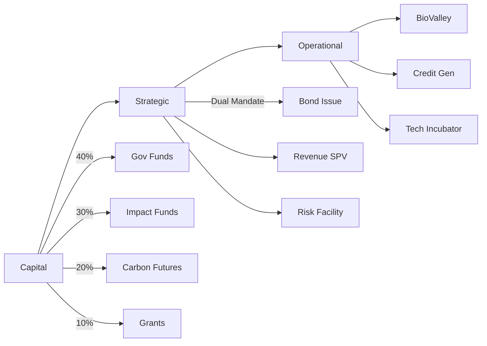
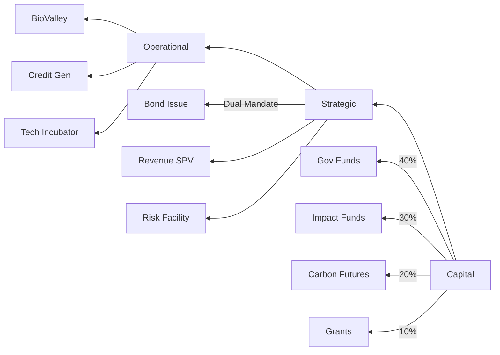
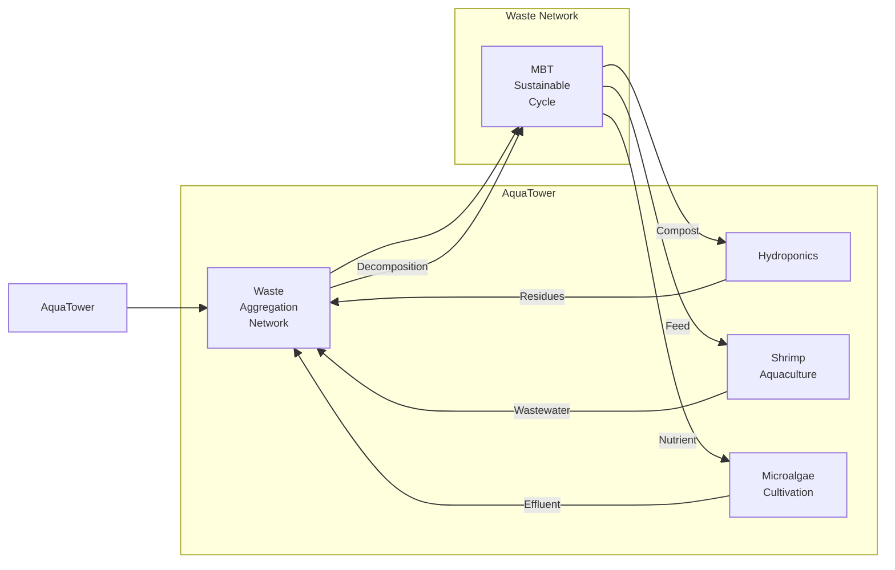
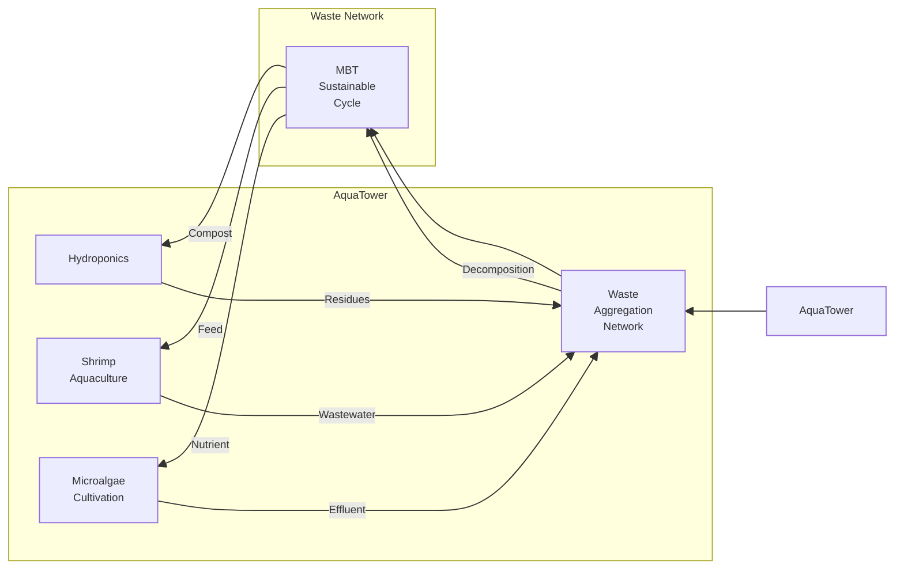
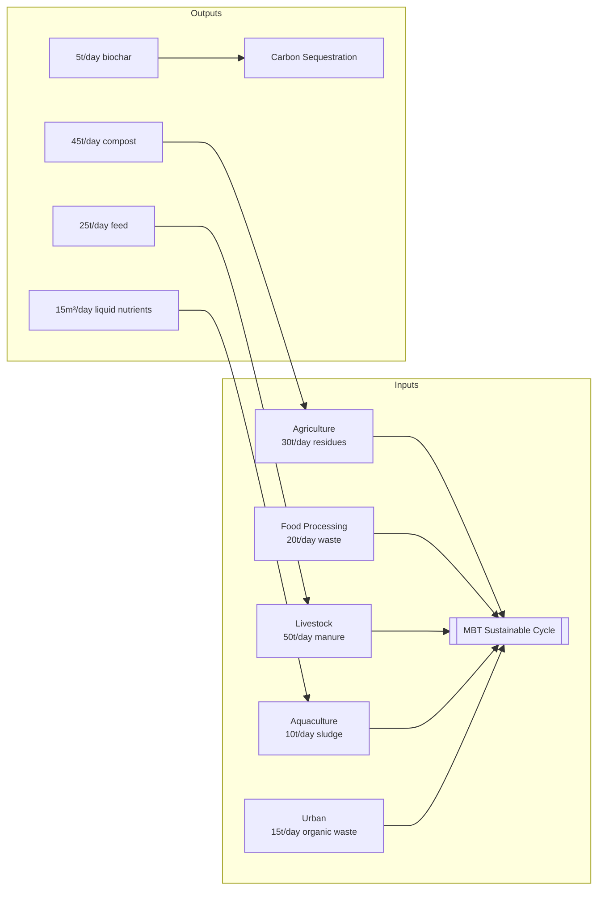

## Preliminary Explanation

### Points of Contention between Food Issues and Global Warming

##### 1. Food Issues

Although agricultural investments, loans, technical assistance, and agricultural development have been provided to developing countries such as those in Africa by organizations including the World Bank and FAO, the results have been limited, and food as well as nutritional issues have not been improved at all. Each country merely proclaims its own food security, paying no attention to global food security; as a result, none of the countries have been able to keep food prices down. With rising medical costs, malnutrition and hunger further drive up healthcare expenditures. Not only can we not solve the food issues of the future, but we cannot even resolve tomorrow’s food problems.

##### 2. Climate Change Mitigation

The greatest challenge we face is climate change, which significantly affects food issues. Abnormal weather patterns such as frequent typhoons, heavy downpours, heat waves, and cold snaps cause floods, droughts, frost damage, and forest fires. These events severely impact food production, water resources, energy supplies, social infrastructure, the daily lives, health, and economic activities of people, leading to soaring prices for food and raw materials, increased medical expenses, and enormous disaster recovery costs that strain public finances and heighten economic, insurance, and financial risks.

The cause of climate change is the increase of greenhouse gases. Human economic activities—such as food production and fossil fuel extraction—have excessively depleted soil organic carbon, raising the concentration of carbon dioxide in the atmosphere. There are estimates that the carbon released from the loss of soil organic matter from prehistoric times until now is more than twice the amount released by human consumption of fossil fuels. Through agricultural production, land development by deforestation, and urban expansion, we have extracted vast amounts of soil carbon, disrupted the carbon cycle, degraded soils, and reduced biomass.

Soils (to a depth of 2 m) on Earth store between 1,500 and 2,400 Gt of carbon, most of which is in the form of soil organic matter (SOM) originating from compounds synthesized by plants and microorganisms. The amount of carbon stored in soils is roughly three times that found in the atmosphere as carbon dioxide (CO₂) and about four times that in plant biomass. In addition, more than 80% of the nitrogen – the nutrient most essential for plants – exists in SOM within terrestrial ecosystems. In other words, SOM is the largest reservoir of carbon and nitrogen in terrestrial ecosystems.

This Earth system approach includes ecological processes fundamental to ecology—such as the “ecological hypercycle” driven primarily by microorganisms and carbon cycling—and it aligns with sustainable agricultural systems. Humanity should be able to overcome global warming by utilizing the diversity of soil microorganisms. In fact, sustainable agriculture based on soil remediation (restoration of soil organic matter and microorganisms) and material cycling is a crucial countermeasure against global warming.

We have demonstrated that the MBT55 (Multi-Biotechnology/Microbial Consortium) and MBT Sustainable Cycle (organic matter decomposition system), which promote the ecological hypercycle and carbon cycling, can restore degraded soils and enhance productivity through carbon and nutrient cycling. Integrating Earth system science with ecology shows how carbon cycling and sequestration can be managed to mitigate climate change and achieve sustainable food production.

I intend to establish a high-functioning food production infrastructure based on the MBT Sustainable Cycle—which strongly promotes the hypercycle, carbon cycling, and sequestration—across Africa. This infrastructure would form the basis of a sustainable food system for the world and a multilateral foundation for food security, contributing to global food systems under a changing climate.

MBT55/MBT Sustainable Cycle makes a significant contribution to the ecological hypercycle and carbon cycling/sequestration – both critical to the Earth system. It also helps stabilize food prices by offsetting waste treatment costs through composting and domestic production of fertilizers, while also playing various roles in carbon cycling, sequestration, and humus generation. I have been contemplating how to deploy the MBT Sustainable Cycle throughout Africa, collecting food waste, converting it into compost and feed, and contributing to carbon sequestration as well as the development of agricultural and livestock production.

---

In order to achieve these objectives, I must explain the technical details and economic benefits to government agencies, agricultural production companies, research institutions, investors, and financial institutions across Africa, thereby engaging them in the AGRIX Project. Before that, I present a simulation of the economic benefits of introducing MBT55/MBT Sustainable Cycle.

#### Economic Impact Simulation of the AGRIX Project in Nairobi

This simulation aims to estimate the economic impact of the AGRIX Project in Nairobi, Kenya. It calculates the effects of waste treatment via the MBT Sustainable Cycle, the input into agricultural production, reductions in medical costs, and food loss reductions, evaluating the project's overall economic benefits.

**Calculation Assumptions**

- Population: 4.4 million
- Agricultural production: Sufficient to feed Nairobi’s population
- Livestock, dairy, and aquaculture production: Sufficient to feed Nairobi’s population
- Amount of food and processing waste: Calculated based on agricultural production and livestock/dairy/aquaculture production
- Quantity of livestock excreta: Calculated based on livestock/dairy/aquaculture production
- Amount of food loss: Calculated based on agricultural production and livestock/dairy/aquaculture production
- Medical expenses: Annual medical expenses in Nairobi
- MBT fermentation machine processing capacity: 10 tons per day
- Price of MBT fermentation machine: 5 million yen per unit
- Price of MBT functional compost/feed: Half the price of imported fertilizer/feed
- Price of MBT probiotic product: Standard price for functional foods aimed at Africa’s affluent consumers
- Medical cost reduction effect: 30% reduction in medical expenses due to MBT probiotic products
- Food loss reduction effect: 30% reduction in food loss
- Effect of domestic production of imported fertilizer/feed: 100% domestic production of what was previously imported
- Effect of restoring degraded soil: Improvement in food issues and nutritional problems through increased yields, enhanced quality and nutritional value, and better freshness retention, leading to future medical cost reductions (30%)

**Results**

Based on the above parameters, the simulation estimates the total annual economic impact of the AGRIX Project in Nairobi to be approximately 132.16 billion yen (with a maximum of 330 billion yen). By establishing production bases across Africa through the introduction of the MBT Sustainable Cycle, we can restore degraded soils, greatly enhance productivity, significantly improve food and nutritional issues, and simultaneously advance large-scale carbon sequestration.

---

#### Expansion of the AGRIX Project for Soil Restoration and Improvement of Food Issues in Africa

When considering the future of global food security, a comprehensive approach that includes the following elements is necessary:

##### 1. Promotion of Sustainable Agriculture

- Construction of BioValleys through the introduction of the MBT Sustainable Cycle
- Establishment of frameworks for the aggregation of food waste, involving livestock, aquaculture, reforestation, and government bodies
- WeFarm: Securing labor, supporting agricultural entrepreneurs, and agri-incubation
- The AGRIX Platform, which manages AgriWare®—a system for accumulating, analyzing, and providing agricultural data—and the MBT Sustainable Cycle with compost production and carbon sequestration operational capabilities, provides state-of-the-art agricultural technology information and a wide range of solutions to support agricultural production. In parallel, business development focused on the deployment of the MBT Sustainable Cycle and BioValley, as well as nurturing startups and investing in projects, will be undertaken. Amazon, along with contributions from related companies, will create an agricultural business fund, gathering broad talent to support agricultural business and service development. An increase in BioValley startups will contribute to Amazon’s network expansion and business growth.
- Establishment of educational infrastructure to secure the adoption of the technology
- Collaborative research with universities and research institutions to develop and operate the AGRIX Platform

##### 2. Strengthening the Food Supply Chain

- Infrastructure development: Establish proper storage, transportation, and distribution systems to minimize food losses.
- Supply chain improvement: Attract companies such as Amazon and food distribution enterprises, and strengthen international trade networks.
- Multilateral food security: Coordinate among BioValleys to adjust food production and maintain food reserves.
- Creative fair trade manufacturing: BioValleys, with the MBT Sustainable Cycle as one of their core values, can offer value chains in agriculture, livestock, dairy, aquaculture, food processing, and distribution to improve quality, reduce costs, and enhance nutritional value. Furthermore, through proposals such as the development of high-quality dairy products, high-value pork or meat production, prevention of infections such as avian influenza, liberation of soils from heavy metals and chemicals, and other measures, creative fair trade manufacturing (proposal-based food production) can be realized. Amazon’s food distribution and AWS/AGRIX’s agricultural and food data analysis will support these initiatives. This concept of creative fair trade manufacturing will improve the status of agricultural production in developing countries.
- Strengthening of producer cooperatives:
    - Enhance cooperatives so that producers can negotiate more effectively with distributors.
    - Support cooperatives in directly accessing consumer markets.

##### 3. Policy and Regulation Reforms

- Strengthening MBT Sustainable Cycle policies: Enhance subsidies and technical support for farmers to back sustainable agriculture.
- Policies for aggregation of food waste: Support networking and waste treatment in agriculture, livestock, dairy, aquaculture, and reforestation.
- Review of trade policies: Re-examine tariffs and subsidies related to food imports and exports to stabilize the global food market.
- Expansion of facilities for food security: Construct systems to enable food support during emergencies.

##### 4. Nutritional Improvement and Diversification of Food

- Promotion of a balanced diet: Encourage balanced eating habits through nutritional education.
- Encouragement of diverse crop cultivation: Promote the cultivation of high-nutrition crops and indigenous varieties to secure food diversity.

##### 5. Adaptation to Climate Change

- Climate-resilient agriculture: Develop and disseminate crops with drought and salinity tolerance to build an agricultural system that can withstand climate change – an objective that MBT55 can achieve.
- Risk management and disaster countermeasures: Strengthen disaster risk management so that farmers can respond quickly to the impacts of climate change.

##### 6. Utilization of Technology and Digitalization

- Digital agricultural platforms: Build the AGRIX Platform to share agricultural and market information and support farmers’ decision-making.
- Smart agriculture technologies: Utilize sensors, drones, AI, and other technologies to improve the efficiency of agricultural production.
- Phenotyping methods: Employ ecological control through AGRIX and MBT phenotyping for growth management.

##### 7. Strengthening International Cooperation

- Global cooperation: Work with international organizations such as FAO, the World Bank, and the United Nations to formulate and implement unified strategies.
- Collaboration with the private sector: Strengthen partnerships with private companies to introduce innovative technologies and funding into the agricultural sector.

---

#### Framework of the AGRIX Project

1. Agricultural Land: Align with the agricultural policies of each country to build BioValleys, which will be supported by local human resources and employment.
2. Cooperation with Universities and Research Institutions: Consider collaborative work for data analysis and development.
3. Networking: Establish a network for the aggregation of processed food waste, livestock excreta, marine by-products, and plant residues for composting and conversion into feed. Cooperation among stakeholders in various fields as well as government and local authorities is essential. Local governments and municipalities will benefit from reduced processing costs and BioValley development.
4. AGRIX Project Operations Headquarters: Responsible for fundraising, management of BioValley operations, and the development and operation of the AGRIX Platform.

#### Fundraising Scheme

- Method: MBT Sustainable Cycle/BioValley Investment Platform
- Fundraising, management, and financial product development: To be executed by the Rothschild Foundation
- Fund Providers: Governments, food distribution companies, food manufacturing companies, dairy companies, livestock companies, insurance companies, investment firms, institutional investors, etc.

This fundraising scheme is intended to take the form of an MBT Sustainable Cycle/BioValley Investment Platform.

The reasons and objectives are as follows:

- To establish it early as the foundation for Africa’s food production, thereby contributing to the improvement of food issues.
- To ensure early and reliable restoration of degraded soils and achieve significant carbon sequestration.
- To implement area-wide (not just point-specific) development, promote local production of fertilizers via the MBT Sustainable Cycle, and contribute to the stabilization of food prices.
- To mobilize funds from developed nations for Africa’s food issues and climate change countermeasures.
- To not only realize sustainable agriculture but also achieve reductions in production costs, food loss, and medical expenses.
- To prove to institutional investors worldwide that carbon sequestration through MBT55 brings about a chain of economic benefits via soil restoration, enhanced productivity, improved quality, better freshness retention, reduced food loss, and decreased medical costs.

To that end, each BioValley will be operated either autonomously or through joint investment and management, and once stable production is achieved after several years, the plan is to transfer the operations to local or global companies.

---

The following is a draft regarding the financial budget and the construction of an investment platform for the AGRIX Project, created based on the above content and conditions. It has been professionally designed with a focus on Africa’s soil restoration and food security.

### **1. Financial Budget Proposal  (5-Year Plan)**  
#### **Total Budget: $287.5M**  
| Category | Budget Breakdown | Description | Regional Allocation |  
|---|---|---|---|  
| **Soil Restoration Infrastructure** | $85M | MBT55 treatment systems ×100 units Soil sensor network deployment | Sahel Region (40%) East African Lakes Zone (30%) Southern Africa (30%) |  
| **Farmer Education Program** | $22M | Digital agriculture training centers ×20 hubs Mobile learning platform development | Allocated by population density & literacy rates |  
| **Technology Implementation** | $63M | AGRIX Platform development Drone crop monitoring systems AI pest prediction models | Pan-regional infrastructure |  
| **Infrastructure Development** | $74M | BioValley ×10 facilities Waste collection networks Cold chain logistics | Strategic locations along economic corridors |  
| **Sustainability Management** | $18.5M | Carbon sequestration certification B Corp audits Long-term ecosystem monitoring | Third-party partnerships |  
| **Partnership Building** | $15M | Government council operations NGO collaboration fund International agency coordination | Adaptive to local governance |  
| **Risk Mitigation** | $10M | Climate parametric insurance Political risk coverage Technology guarantee fund | Swiss Re co-insurance pool |  

---

### **2. MBT Sustainable Cycle/BioValley Investment Platform Design**  
#### **Three-Tier Blended Finance Model**  

---

---
#### **Key Features**  
1. **Dynamic Valuation**: +0.5% yield per 1% increase in soil organic carbon  
2. **Risk Mitigation**: MIGA political risk guarantees  
3. **Exit Strategy Alignment**: 20% priority return to initial investors  

---

### **3. Initial Investor Profile**  
| Sector | Examples | Investment Rationale | Target Share |  
|---|---|---|---|  
| **Government** | African Union EU Global Gateway | SDG achievement metrics | 25% |  
| **Development Finance** | AfDB IFAD Agriculture Fund | Climate resilience | 20% |  
| **Food Industry** | Cargill Danone Tetra Pak | Supply chain optimization | 18% |  
| **Tech** | Amazon Climate Pledge Fund IBM Food Trust | Data rights acquisition | 15% |  
| **Insurance** | Swiss Re AXA Climate | Product innovation | 12% |  
| **Energy** | ACWA Power BP Low Carbon | Carbon offset needs | 10% |  

---

### **4. BioValley Acquisition Targets**  
#### **Strategic Buyers**  
| Sector | Company Examples | Value Capture |  
|---|---|---|  
| **Agribusiness** | Bayer CropScience Syngenta Group | Seed R&D hubs |  
| **Food Manufacturing** | Nestlé Unilever | Raw material optimization |  
| **Renewables** | NextEra Energy Blue Economy | Biogas integration |  
| **Retail** | Walmart Zero Hunger Tesco | Sustainable sourcing |  
| **Mining** | Rio Tinto BHP | Post-mining land rehab |  
| **Pharma** | Novartis Merck | Medicinal crop cultivation |  
| **Tech** | Microsoft AI for Earth Google X | Agricultural databases |  
| **Finance** | BlackRock Sustainable Brookfield | ESG asset creation |  

#### **Carbon-Neutral Synergies**  
- **Amazon**: Scope 3 emission reduction  
- **Marks & Spencer**: Plan A 2030 targets  
- **Airbus**: Sustainable aviation feedstock  

---

### **5. Credit Revenue Projections**  
#### **Annual Credits per BioValley**  
| Credit Type | Formula | Price | Annual Revenue |  
|---|---|---|---|  
| **Carbon** | 5tCO2e/ha ×1,000ha ×90% additionality | $50/t | $225,000 |  
| **Biodiversity** | 3 units/ha ×1,000ha | $20/unit | $60,000 |  
| **Water** | 10% quality improvement × watershed | $15/m³ | $45,000 |  
| **Social** | 100 jobs × fair wage index | $300/job | $30,000 |  

#### **Scale Effects (10 BioValleys)**  
- **Years 1-5**: Cumulative $18M (post-verification discounts)  
- **Maturity Phase**: $3.6M/yr +7% annual appreciation  

---

### **6. Differentiation Strategy**  
4. **Dual Credit Mechanism**: Simultaneous VCS and Article 6.2 compliance  
5. **Dynamic Capital Allocation**: AI-driven funding based on soil carbon levels  
6. **BioBank NFT System**: Monetizing microbiome data through blockchain  

---

**Conclusion**  
This platform revolutionizes soil restoration through financial innovation ("Soil Alpha Strategy"), aligning climate action with capital market logic. By integrating Rothschild's structured finance expertise with MBT55's proven performance, we propose creating an "Ecosystem Beta" metric to transcend conventional ESG investing. The first-phase "Carbon Fertility Belt" across five African nations will catalyze global food system transformation.  

(Note: Figures assume 1USD=150JPY conversion rate for consistency with original calculations.)

---

### **Redefined: AquaTower & Waste Aggregation Network**

---

### **1. Strategic Redefinition of AquaTower**
#### **"Vertically Integrated Ecosystem Infrastructure"**
| Level | Function | Waste Output | Resource Conversion |
|---|---|---|---|
| **Hydroponics** | Leafy Greens/Herbs | 2t/day plant residues | MBT compost feedstock |
| **Freshwater Aquaculture** | Tilapia Farming | 50m³/day wastewater | Hydroponic water reuse |
| **Marine Aquaculture** | Shrimp/Seaweed Symbiosis | 1t/day organic sludge | Algae culture medium |
| **Microalgae** | Spirulina Production | 10m³/day effluent | Biofuel feedstock |
| **Energy** | Biogas Power Generation | 5m³/day digestate | Liquid fertilizer |

**Innovation**  
- Gravity-driven material circulation between levels  
- 95% reuse of aquaculture wastewater in hydroponics  

---

### **2. Advanced Waste Aggregation Network**
#### **"5-Dimensional Material Flow"**

**Strategic Value**  
- 60% reduction in regional waste management costs  
- $1.2M/year/site fertilizer import substitution  

---

### **3. Enhanced Economic Model**
#### **"Waste Debenture System"**
| Metric | Formula | Financial Instrument |
|---|---|---|
| **Waste Processed** | 1t=1WU (Waste Unit) | Municipal service fees |
| **Carbon Conversion** | 1WU=0.5tCO2e | Carbon credit issuance |
| **Nutrient Value** | 1WU=30kgN-P-K | Fertilizer replacement valuation |
| **Water Purified** | 1WU=10m³ | Water rights trading |

---

### **4. Strategic Improvements**
1. **AquaTower Evolution**  
   - Transforms from production facility to "Ecosystem Service Generator"  
   - Example: Top-level algae cultivation adds air purification  

2. **Network Optimization**  
   - Shifts from waste "collection" to "strategic redistribution"  
   - AI-optimized MBT feedstock blending ratios  

3. **New Revenue Streams**  
   - Blockchain-certified waste data sales  
   - Rare mineral recovery from aquaculture effluent  

---

### **5. Investment Impact Simulation (Per AquaTower Site)**
| Metric | Conventional Model | Enhanced Model | Improvement |
|---|---|---|---|
| Construction Cost | $18M | $22M | +22% |
| Operating Margin | 15% | 34% | +126% |
| Waste Revenue | $0.3M/yr | $1.8M/yr | 500%↑ |
| Carbon Credits | 0.2ktCO2e | 1.5ktCO2e | 650%↑ |
| Water Reuse | 30% | 92% | 207%↑ |

---

**Conclusion**  
This redefinition positions AquaTower as an "Ecosystem Profit Facility" generating $2.5M annual waste-related revenue per site. By reconceptualizing the waste network as a "Regional Metabolic Engine," we transcend traditional CSR approaches to establish a "Waste Capitalism" model. For Rothschild Foundation, combining Waste Debentures with Asset-Backed Securities (ABS) creates unprecedented investment products anchored in waste processing volumes.

