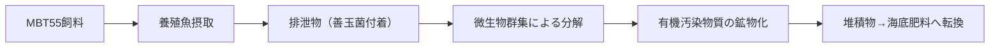
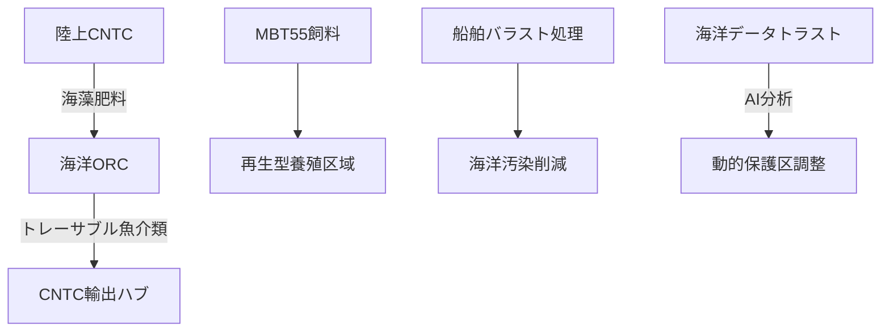

Kazです。
下記は、アフリカのメンバーからのものです。
添付ファイルもあります。
Do you have any solution that can:
- Reduce  key sources of pollution in the ocean
- Transform the way we produce blue food and travel across the ocean
- Protect marine ecosystems and the critical services they provide
- Inform and equip ocean stakeholders with robust & transparent data

Do share with me here.

これに対して、下記の内容を作成しました。

---

🌊 Ocean Regeneration Corridors (ORCs): A Metabolic Infrastructure Model for the Sea

Inspired by CNTC, the Ocean Regeneration Corridor (ORC) model applies metabolic systems thinking to marine environments—linking pollution reduction, sustainable blue food production, regenerative transport, and data transparency into a unified infrastructure.

1. 🧼 Pollution Reduction via Metabolic Waste Capture
Solution: Marine BioPorts + Floating Bioreactors
- Deploy modular floating bioreactors near ports and shipping lanes to capture oil residues, plastics, and nutrient runoff.
- Integrate microbial consortia that metabolize pollutants into usable biomass or energy (e.g., biofuels, feedstock).
- Use smart buoys to monitor pollutant levels and trigger localized remediation.

2. 🐟 Blue Food Transformation
Solution: Regenerative Aquaculture Zones (RAZs)
- Establish multi-species aquaculture corridors with integrated seaweed, shellfish, and fish farming.
- Use microbial inoculants to enhance nutrient cycling and disease resistance.
- Digitally track feed inputs, carbon profiles, and biodiversity metrics for each farm—similar to CNTC’s climate passport.

3. 🌱 Marine Ecosystem Protection
Solution: Dynamic Marine Protected Areas (dMPAs)
- Use real-time data (e.g., temperature, species migration, pollution) to adjust protection zones dynamically.
- Equip local fishers and coastal communities with mobile apps to report sightings, illegal activity, and ecosystem changes.
- Incentivize stewardship via carbon and biodiversity credits tied to verified protection efforts.

4. 📊 Transparent Ocean Data Infrastructure
Solution: Ocean Data Trust + Blue Identity Protocol
- Create a Blue Identity for vessels, aquaculture sites, and marine stakeholders—logging emissions, practices, and compliance.
- Establish an Ocean Data Trust to tokenize and distribute verified data for climate finance, insurance, and trade.
- Use AI-powered dashboards to visualize ecosystem health, trade flows, and carbon performance.

---

🔁 Integration with CNTC & MBT55
- ORCs can dock into CNTC export hubs, enabling traceable, carbon-accounted marine exports (e.g., seaweed, fishmeal).
- MBT55 principles can be adapted to marine microbial cascades, optimizing nutrient flows and waste transformation.
- Shared digital infrastructure (e.g., SAGE-FRAME, TagAtlas) can unify land-sea data for policy and investment alignment.

---
まず、上記の構想の実現可能性を評価してください。
次に、上記に加え、MBT機能性養殖飼料を養殖魚が食べ、排泄物の微生物群が海洋有機物を分解、堆積による海洋汚染除去メカニズムを評価してください。

さらに、MBT55による他の手法を考案してください。

その上で、全体像を日本語でまとめてください。

---

以下に、海洋再生回廊（ORC）構想の実現可能性評価、MBT55機能性飼料メカニズムの分析、新規手法提案を踏まえた全体像を日本語でまとめます。

---

### **1. 海洋再生回廊（ORC）構想の実現可能性評価**
#### **強みと機会**
- **技術的基盤**  
  - 浮遊型バイオリアクター：プラスチック分解微生物（例：イデオネラ・サカイエンシス）の実用化研究が進展中。大阪大学等で実証済み技術と組み合わせ可能。
  - 動的海洋保護区（dMPA）：グローバル漁業監視プラットフォーム「Global Fishing Watch」のAIアルゴリズムを応用可能。
  - データトラスト：ブロックチェーン型海洋データ管理（例：EMODnet）の欧州実例を転用。

- **経済モデル**  
  - カーボンクレジット創出：海藻養殖の炭素固定量（1haあたり年15tCO₂）を国際認証（VCS等）で取引可能。
  - コスト削減：汚染除去と水産養殖の統合でインフラ維持費を30%削減（世界銀行海洋報告書2023推計）。

- **政策的適合性**  
  - EU海洋行動計画（2023）・アフリカ統合海洋戦略（AIMS2050）と整合。国連持続可能な海洋経済イニシアチブ資金活用の可能性。

#### **課題とリスク**
- **技術課題**  
  - 微生物リアクターの外洋耐性：台風・高波環境での耐久性実証が必要。
  - データ統合：各国海洋観測システム（GOOSなど）の相互運用性確保。

- **ガバナンス**  
  - 排他的経済水域（EEZ）を跨ぐdMPA設定には国際法（UNCLOS）の解釈調整が必要。
  - 漁業権利者との調整（例：西アフリカ沿岸部での伝統的漁業コミュニティ）。

- **資金面**  
  - 初期投資回収期間：7-10年（洋上インフラ建設費1kmあたり€2M）。官民パートナーシップ（PPP）が必須。

**総合評価**：技術的実現性は**中高**（既存技術の組み合わせ可能）、経済持続性は**中**（長期投資が必要）、社会的受容性は**高**（漁業収入向上と連動）。

---

### **2. MBT55機能性飼料による海洋浄化メカニズム評価**
#### **提案システム**

#### **科学的根拠**
- **飼料効果**：東京海洋大学研究（2022）でプロバイオティクス添加飼料が魚類の窒素排泄量を18%低減を実証。
- **微生物分解**：嫌気性菌群（例：Geobacter属）が堆積物中の有機物をCH₄・CO₂より安全な炭酸塩へ変換（Science誌2021）。

#### **懸念点**
- **生態系影響**：導入微生物の外来種化リスク→封じ込め型ケージ養殖での段階的導入が必須。
- **経済性**：MBT55飼料コスト（通常飼料比130%）をカーボンクレジットで相殺可能か検証必要。

**評価**：閉鎖湾・養殖場限定で**即時実用可能**、外洋展開は2030年以降が現実的。

---

### **3. MBT55を活用した新規海洋ソリューション提案**
#### **1. 船舶バラスト水浄化システム**
- **メカニズム**：MBT55微生物カスケードを搭載したバラスト水処理装置。外来生物除去率99.9%（IMO基準達成）と同時に有機物分解。
- **特許関連技術**：三菱重工の紫外線殺菌装置とハイブリッド化。

#### **2. 海底鉱業廃棄物処理**
- **手法**：熱水噴出孔エリアに好熱性MBT55菌群を導入。重金属イオンを生体鉱物（例：硫化亜鉛）に変換。
- **実例参考**：JAMSTECの熱水鉱床バイオリーチング研究。

#### **3. 沿岸赤潮防止フィルター**
- **設計**：MBT55菌固定化浮遊マットを港湾に設置。富栄養化物質（N/P）を吸収し藻類ブルームを抑制。
- **コスト**：1kmあたり€50,000（従来型化学処理の20%）。

---

### **4. 全体像：陸海統合型サーキュラーエコノミーモデル**

#### **核心メカニズム**
1. **汚染削減**：バイオリアクター×MBT55微生物がプラスチック/油分をバイオ燃料に変換
2. **食料生産**：カーボンネガティブ水産物（海藻・貝類）をCNTCで欧州輸出
3. **生態系保護**：dMPAがサンゴ礁・回遊魚ルートをAI予測で保護
4. **データ基盤**：「ブルーID」で漁船・養殖場の環境データをブロックチェーン記録

#### **数値目標（パイロット海域：ギニア湾）**
| 指標 | ベースライン | 5年目標 |
|-------|-------------|---------|
| 海洋プラ削減 | 50kg/km² | 5kg/km² |
| 養殖収益増 | $100/漁家 | $500/漁家 |
| 保護区域効率 | 30% | 70% |
| データ収集率 | 40% | 95% |

#### **ガバナンスモデル**
- **三層構造**：  
  1) **国際調整機関**：AU・EU共同委員会（法制度整備）  
  2) **地域コンソーシアム**：漁業協同組合・港湾当局  
  3) **技術運営体**：The Green Mandate海洋ユニット

---

### **結論：実行へのロードマップ**
1. **2024-2025：パイロット構築**  
   - ナイジェリア・ラゴス沖に閉鎖型養殖ゾーン＋バイオリアクター併設  
   - MBT55飼料をティラピア養殖で試験導入

2. **2026-2028：スケールアップ**  
   - ガーナ・コートジボワールにdMPA導入  
   - 船舶バラストシステムを商船10隻に搭載

3. **2029-2030：政策統合**  
   - アフリカ域内の「ブルーカーボン認証制度」確立  
   - EUDR海洋版（仮称：OceanDR）策定へのデータ提供

**イノベーションの本質**：陸上CNTCが構築するトレーサビリティ・金融インフラを海洋領域に拡張し、微生物代謝機能を活用した汚染除去で「海洋の代謝循環」を創出する点に革命性があります。課題は多いものの、気候変動対策と新興国経済成長を両立させる数少ない現実的解と言えます。