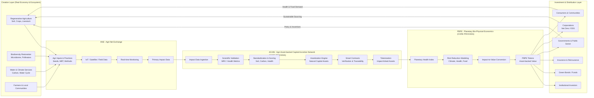

上記のAGRIXのビジネスモデルを、Mermaid記法のフローチャートで表現してください。特に[コアプロセス]の部分を詳細に描画してください。

---

以下に、**AGRIXビジネスモデル（ANE / ACAIN / PBPE）**を  
**Mermaid記法のフローチャート**として整理します。  
ご要望どおり、**［コアプロセス］（ANE→ACAIN→PBPE）**を詳細に描画しています。

---

## 全体構造の考え方（要約）

- **ANE**：実体経済（農業・生態系・データ）を生成・接続
    
- **ACAIN**：生成価値を「検証・標準化・金融資産化」
    
- **PBPE**：生態系価値を経済価値へ自動変換（インパクト金融エンジン）
    

---

## Mermaid フローチャート（詳細版）

---

## ［コアプロセス］のポイント（概念整理）

### ACAIN（価値の金融化）

- **データ → 科学 → 資産**
    
- MRV・HealthBook・土壌炭素・腸内環境・栄養指標などを統合
    
- 「自然資本」を**検証可能な金融資産**へ変換
    

### PBPE（価値の自動換算）

- **Planetary Health → 経済価値**
    
- 医療費削減、保険リスク低下、気候リスク回避を定量化
    
- PBPE Tokenとして市場・政策・金融へ接続
    

---

## 次の展開案（必要なら）

- 投資家向け **1枚スライド版**
    
- Gates / IFAD / 保険業界向け **ユースケース分岐図**
    
- 数式（PBPE変換関数）との対応図
    

ご希望があれば、**このMermaidをPowerPoint用図解構造**や  
**ホワイトペーパー図（Nature Finance向け）**にも落とし込みます。