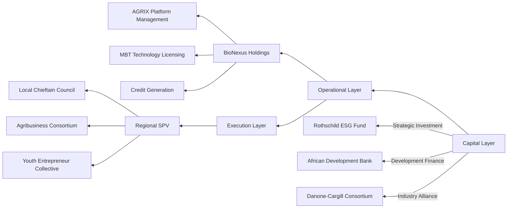

### **1. Optimal Governance Model for BioValley**  
#### **"Tripartite Hybrid Structure"**  

#### **Design Philosophy**  
- **Capital Layer**: Rothschild Foundation acts as catalytic capital, blending industrial and developmental funds  
- **Operational Layer**: BioNexus establishes digital infrastructure for standardizing 3,000 hubs  
- **Execution Layer**: Hybrid governance combining traditional authority and modern agri-management  

---

### **2. Operational Organization Framework**  
#### **"3-Tier 5-Function Model"**  
| Tier | Function | Components | Role |  
|---|---|---|---|  
| **Central HQ** | Capital Mobilization Tech Development | Rothschild Structured Finance Team MIT Digital Agriculture Lab | Carbon pricing architecture AI crop prediction models |  
| **Regional Hub** | Local Adaptation Risk Management | Anthropologist-Agronomist Teams Swiss Re Local Office | Tribal farming calendar database Drought parametric insurance |  
| **Field Unit** | Production Execution Community Engagement | Elder Council Women Agri-Entrepreneurs MBT Evangelists | Blending traditional/MBT farming Profit-sharing mechanisms |  

---

### **3. Innovative Management Model**  
#### **"Digital Tribal Economy" Concept**  
1. **Land Trust System**:  
   - Blockchain registration of tribal lands  
   - 20% revenue auto-allocated to community fund  

2. **Dual Incentives**:  
   - Base payment: Yield-based cash  
   - Bonus: Carbon-linked NFT tokens  

3. **Next-Gen Education**:  
   - AGRIX Academy combines digital farming/traditional knowledge  
   - Top graduates become "MBT Ambassadors" with startup support  

---

### **4. Strategic Exit Pathway**  
#### **"5-Phase Exit Ladder"**  
| Phase | Exit Target | Examples | Value Creation |  
|---|---|---|---|  
| **Initial** | Infrastructure Assets | Brookfield Asset Management McKinsey Infrastructure Fund | Irrigation system REITs |  
| **Growth** | Data Rights | Palantir GIC Singapore | Satellite crop data sales |  
| **Maturity** | Bio-Assets | Bayer Divergence Gates Foundation | Microbiome databank |  
| **Expansion** | Certification Rights | Verizon Blockchain DNV GL | Carbon credit verification |  
| **Final** | Brand Value | LVMH Agriculture Nestlé Luxe | Premium crop trademarks |  

---

### **5. Strategic Recommendations for Rothschild Foundation**  
#### **"Soil Finance Initiative"**  
4. **Dynamic Debt-Equity Conversion (DDEC)**:  
   - 10% debt-to-equity conversion per 1% soil carbon increase  
   - Example: $10M loan → $2M equity at 2% carbon gain  

5. **Climate Migrant Response Fund**:  
   - "Climate refugee hiring quotas" in restored areas  
   - EU migration policy-linked bonds  

6. **Traditional Knowledge Derivatives**:  
   - IP monetization of tribal farming methods  
   - Example: Maasai herding patterns → AI feed algorithms  

---

### **6. Advanced Risk Management**  
#### **"Paradoxical Insurance Models"**  
- **Drought Risk Transfer**:  
  - ETH blockchain-based "Drought Bonds" triggered by rainfall deficits  
  - Investors buy risk, farmers secure liquidity upfront  

- **Political Risk Mitigation**:  
  - Cross-border hubs spanning 3 nations  
  - Example: Nigeria-Niger-Benin triangular hub  

- **Cultural Friction Resolution**:  
  - Appoint anthropologists as CTOs (Chief Tribal Officers)  
  - Embed farming calendars in DeFi protocols  

---

**Conclusion**  
BioValley's true innovation lies not in "soil financialization technology" but in **"translating tribal social structures into capital market mechanisms."** By adapting Rothschild's medieval European credit wisdom to 21st-century African tribal societies, we synchronize agricultural productivity with global capital's self-reinforcing cycle. We propose first establishing a "Digital Chieftainship" pilot in the Zambezi Basin, fusing traditional authority with blockchain governance.
