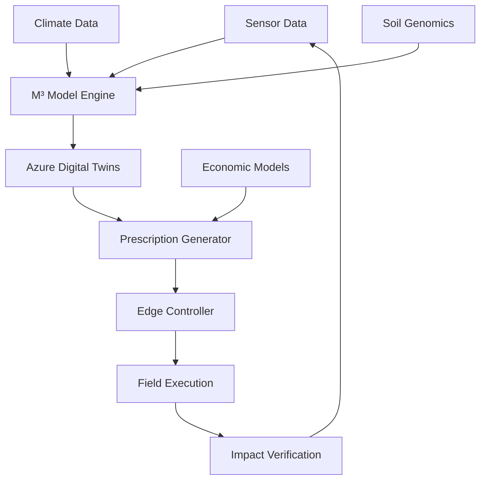

### **📄 README.md (English)**
```markdown
# 🌱 M³-BioSynergy: Microbial-Metabolic-Modular Theory for Ecological Hypercycles

**A Novel Framework for Soil Carbon Sequestration and Regenerative Agriculture**

[](https://www.python.org/downloads/)
[](https://opensource.org/licenses/MIT)
[](https://azure.microsoft.com/)
[](https://github.com/Bionexus-Holdings/AGRIX-M3-BioSynergy/actions)

## 🚀 Overview

M³-BioSynergy is a groundbreaking theoretical framework that models soil as a **self-organizing microbial ecosystem** capable of hyper-accelerated carbon cycling. This repository implements:

- **Microbial Dynamics**: 120-species symbiotic network modeling
- **Carbon Flow Optimization**: Predictive algorithms for carbon sequestration
- **Azure Cloud Integration**: Digital Twins, IoT, and ML implementations
- **Edge Control Protocol**: MPP (Microbial Prescription Packet) for field deployment

## 🔬 Scientific Foundation

Based on the **Ecological Hypercycle Theory** developed by Kaz Shimojo (Bionexus Holdings), this framework bridges:

1. **Complex Systems Theory** (Eigen's Hypercycles)
2. **Microbial Ecology** (120-species MBT55 consortium)
3. **Carbon Cycle Science** (Soil Organic Carbon dynamics)
4. **Digital Agriculture** (IoT, AI, and blockchain integration)

## 🏗️ Architecture




# 🌱 M³-BioSynergy: Microbial-Metabolic-Modular Theory
...（現在表示されている部分）...

## 🏗️ Architecture
...（図表）...

## ⚡ Quick Start
...（インストール手順）...

## 📊 Performance Metrics
...（表）...

## 🗂️ Project Structure
...（構造）...

## 🤝 Contributing
...（貢献方法）...

## 📄 License
...（ライセンス）...

## 📞 Contact
...（連絡先）...

---（ここまでが現在の内容）---

*"We don't inherit the earth from our ancestors; we borrow it from our children."*  
*This project aims to leave it better than we found it.*


Architectureの下に、Installation、Basic Usage、を追加するのですか？
その後の、Performance Metrics...（表）...
Project Structure...（構造）...
は、頂いていません。

その後は、下記の内容でいいのですか？README.mdに追記するのですね？
## 🤝 Contributing

We welcome contributions from researchers, developers, and agricultural scientists. Please read our [Contributing Guidelines](https://contributing.md/).

## 📄 License

This project is licensed under the MIT License - see the [LICENSE](https://license/) file for details.

## 📞 Contact

- **Lead Scientist**: Kaz Shimojo - Bionexus Holdings
    
- **Technical Inquiries**: GitHub Issues
    
- **Partnerships**: partnerships@bionexus.io
    

## 🌐 Other Language Versions

- **[日本語版 (Japanese Version)](https://github.com/shimojok/M3-BioSynergy-JP)** - For Japanese agricultural practitioners, researchers, and domestic partners. Includes J-Credit guidance and Japan-specific case studies.
